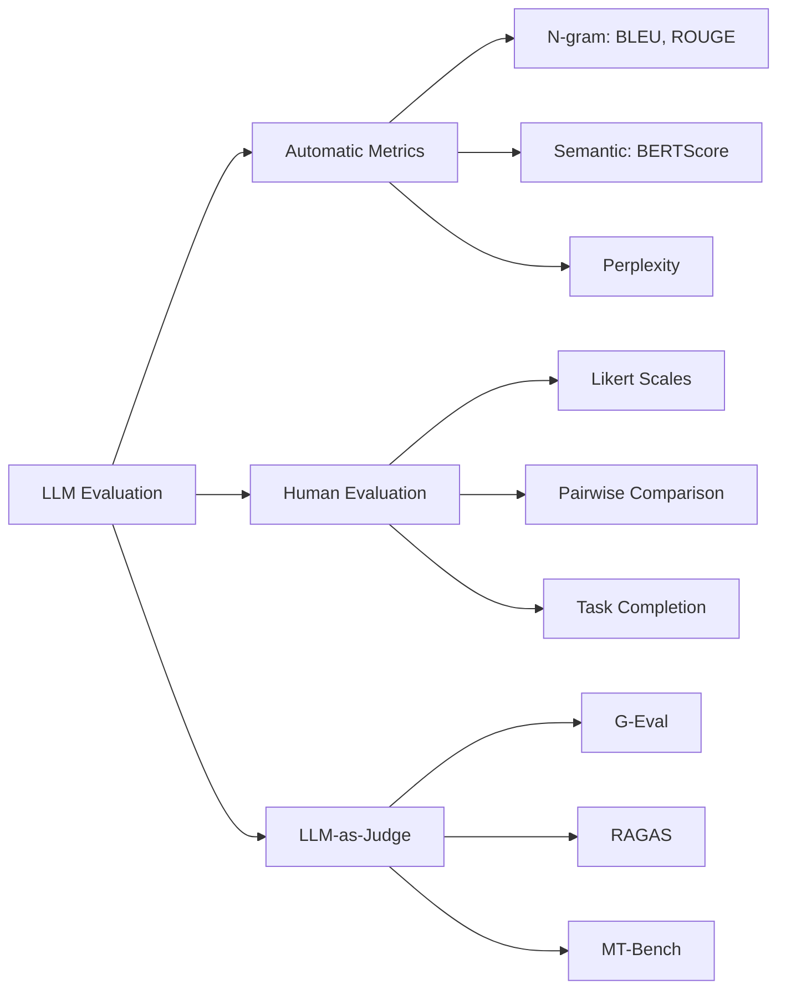
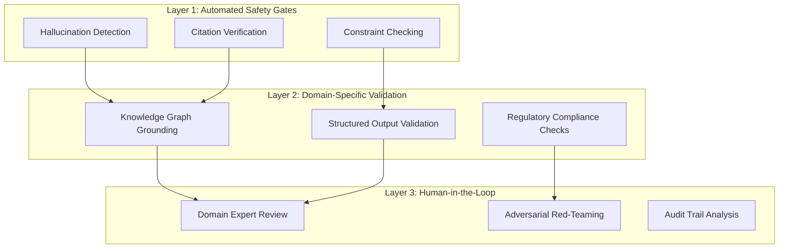

## Overview
Evaluating Large Language Models is fundamentally different from evaluating traditional ML models. Unlike classification (where ground truth is objective) or regression (where error is measurable), LLM outputs are often subjective, creative, and multi-dimensional. There is no single "correct" answer to "Write me a poem about autumn."

LLM evaluation spans multiple dimensions:
- **Accuracy**: Is the information factually correct?
- **Relevance**: Does the output address the query?
- **Fluency**: Is the text grammatically correct and natural?
- **Coherence**: Does the text flow logically?
- **Safety**: Is the output harmful, biased, or toxic?
- **Instruction Following**: Did the model do what was asked?

The challenge is that many of these dimensions are subjective and task-dependent. A metric that works for summarization may be useless for code generation.

## Key Ideas

### The Three Pillars of LLM Evaluation



## Automatic Reference-Based Metrics

These metrics compare the model's output against a known "reference" or "ground truth" answer. They work well when there's a canonical correct answer (translation, summarization).

### BLEU (Bilingual Evaluation Understudy)

Originally designed for machine translation. Measures n-gram overlap between generated text and reference.

$$\text{BLEU} = BP \cdot \exp\left(\sum_{n=1}^{N} w_n \log p_n\right)$$

Where:
- $N$ = maximum n-gram order
- $p_n$ = precision of n-grams (what fraction of generated n-grams appear in reference)
- $w_n$ = weights (typically $\frac{1}{N}$ for uniform weighting)
- $BP$ = Brevity Penalty (penalizes outputs shorter than reference)

$$BP = \begin{cases} 1 & \text{if } c > r \\ e^{(1-r/c)} & \text{if } c \leq r \end{cases}$$

Where $c$ = candidate length, $r$ = reference length.

**Intuition**: "How many chunks of my output also appear in the correct answer?"

**Limitations**:
- Ignores synonyms ("happy" vs "joyful" get no credit)
- Ignores word order importance
- Poor for creative or open-ended tasks

### METEOR (Metric for Evaluation of Translation with Explicit ORdering)

An improvement over BLEU that addresses synonym matching and word order.

**Alignment Process:**
METEOR aligns words between candidate and reference in priority order:
1. Exact matches (highest priority)
2. Stem matches
3. Synonym matches (via WordNet)

$$\text{METEOR} = F_{mean} \cdot (1 - Penalty)$$

Where:
- $F_{mean}$ = Harmonic mean of precision and recall (weighted toward recall)
- $Penalty$ = Fragmentation penalty based on number of "chunks" needed to align texts

Fragmentation Penalty:

$$Penalty = \gamma \left(\frac{chunks}{matched\ words}\right)^\theta$$

Fewer contiguous chunks = better word order = lower penalty.

### ROUGE (Recall-Oriented Understudy for Gisting Evaluation)

Designed for summarization. Unlike BLEU (precision-focused), ROUGE is **recall-focused**: "How much of the reference appears in my output?"

| Variant | Description                | Use Case            |
| :------ | :------------------------- | :------------------ |
| ROUGE-N | N-gram recall              | General overlap     |
| ROUGE-L | Longest Common Subsequence | Sentence structure  |
| ROUGE-S | Skip-bigram (allows gaps)  | Flexible matching   |

$$\text{ROUGE-L} = \frac{(1 + \beta^2) \cdot R_{lcs} \cdot P_{lcs}}{R_{lcs} + \beta^2 \cdot P_{lcs}}$$

Where:
- $R_{lcs} = \frac{LCS(X, Y)}{m}$ (recall)
- $P_{lcs} = \frac{LCS(X, Y)}{n}$ (precision)
- $LCS$ = Longest Common Subsequence length
- $\beta$ = weight for recall vs precision (β > 1 favors recall; typically 1.2 for summarization)

### BERTScore

A **semantic similarity** metric that uses contextual embeddings (BERT) instead of exact string matching.

**How it works:**
1. Encode both candidate and reference with BERT
2. Compute cosine similarity between each token pair
3. Use greedy matching to find optimal alignment
4. Return precision, recall, and F1

$$R_{BERT} = \frac{1}{|x|} \sum_{x_i \in x} \max_{y_j \in y} \mathbf{x}_i^T \mathbf{y}_j$$

$$P_{BERT} = \frac{1}{|y|} \sum_{y_j \in y} \max_{x_i \in x} \mathbf{x}_i^T \mathbf{y}_j$$

$$F_{BERT} = 2 \cdot \frac{P_{BERT} \cdot R_{BERT}}{P_{BERT} + R_{BERT}}$$

**Advantages:**
- Captures semantic similarity ("dog" ≈ "canine")
- Considers context ("bank" in finance vs river)
- Better correlation with human judgment

**Limitations:**
- Computationally expensive
- Still reference-based (needs ground truth)

### COMET (Crosslingual Optimized Metric for Evaluation of Translation)

A neural machine translation metric that uses multilingual embeddings (XLM-RoBERTa) and is trained on human quality judgments. Considered the state-of-the-art for translation evaluation.

**How it works:**
1. Encode source sentence, hypothesis (model output), and reference with multilingual encoder
2. Pool representations and concatenate features
3. Pass through regression head trained on human DA (Direct Assessment) scores
4. Output: quality score (typically 0-1, higher is better)

Unlike BLEU/BERTScore which compare strings, COMET is trained to **predict human judgments directly**.

**Advantages:**
- Highest correlation with human judgment for translation
- Handles multilingual evaluation well
- Reference-free variants available (COMET-QE)
- Captures fluency, adequacy, and errors simultaneously

**Limitations:**
- Computationally expensive (requires GPU for speed)
- Model-dependent (different COMET versions give different scores)
- Less interpretable than n-gram metrics

### Comparison of Reference-Based Metrics

| Metric | Type | Synonym Support | Order Sensitivity | Compute Cost | Best For |
|:-------|:-----|:----------------|:------------------|:-------------|:---------|
| BLEU | N-gram Precision | No | Partial | Low | Translation |
| ROUGE | N-gram Recall | No | Partial (ROUGE-L) | Low | Summarization |
| METEOR | Hybrid | Yes (WordNet) | Yes | Medium | Translation |
| BERTScore | Embedding | Yes (Contextual) | No | High | General semantic |
| COMET | Neural (trained) | Yes (Learned) | Yes | High | Translation (SOTA) |

## Reference-Free Metrics

These metrics evaluate outputs without needing ground truth. Essential for creative or open-ended tasks.

### Perplexity

Measures how "surprised" a language model is by the text. Lower perplexity = more fluent/natural text.

$$\text{Perplexity}(X) = \exp\left(-\frac{1}{N}\sum_{i=1}^{N}\log P(x_i|x_{<i})\right)$$

Where $P(x_i|x_{<i})$ is the probability of token $x_i$ given all previous tokens.

**Intuition**:
- If a model assigns high probability to every token → low perplexity → fluent text
- If a model is constantly surprised → high perplexity → unusual text

| Use Case | How Perplexity Helps |
|:---------|:---------------------|
| **Model Comparison** | Compare versions of the same model (lower PPL = better LM) |
| **Training Monitoring** | Track PPL on validation set during fine-tuning |
| **Fluency Check** | Flag unusually high-PPL outputs for review |
| **Hallucination Detection** | Hallucinated facts often have higher perplexity |
| **Domain Adaptation** | Measure how well model fits new domain text |
| **Prompt Engineering** | Compare output quality across different prompts |

#### Evaluating LLM-Generated Text with Perplexity

You can use an **external judge model** to compute perplexity on generated text:

```
                    ┌─────────────────────┐
   Generated Text   │   Judge Model       │   Perplexity
   ───────────────► │   (e.g., GPT-2,     │ ───────────────►
   "The cat sat..." │   LLaMA, Mistral)   │   Score: 12.3
                    └─────────────────────┘
```

Use a *different* model as the judge. If Model A generates text, use Model B to score its perplexity. This prevents self-evaluation bias.

**Interpretation:**
- **Low perplexity (< 20)**: Fluent, natural-sounding text
- **Medium perplexity (20-50)**: Acceptable, may have awkward phrasing
- **High perplexity (> 50)**: Unusual constructions, potential issues
- **Very high perplexity (> 100)**: Likely gibberish, hallucinations, or domain mismatch

> [!NOTE]
> Perplexity thresholds are model-dependent. Always calibrate on known-good examples first.

#### Perplexity for Hallucination Detection

Hallucinated content often exhibits **locally high perplexity** because:
1. Made-up entities have unusual token sequences
2. False facts create inconsistent contexts
3. Non-existent relationships surprise the model

**Approach:**
```
1. Compute token-level log probabilities
2. Identify spans with unusually low probability
3. Flag these as potential hallucinations
4. Cross-reference with source for verification
```

#### Perplexity vs. Cross-Entropy

They're closely related:

$$\text{Cross-Entropy}(X) = -\frac{1}{N}\sum_{i=1}^{N}\log P(x_i|x_{<i})$$

$$\text{Perplexity}(X) = \exp(\text{Cross-Entropy}(X))$$

- **Cross-entropy**: Measured in bits/nats, used in loss functions
- **Perplexity**: More interpretable (effective vocabulary size per token)

Perplexity of 10 means the model is, on average, as uncertain as if choosing uniformly among 10 options.

**Limitations:**
- Measures fluency, not accuracy or relevance
- A grammatically perfect lie has low perplexity
- Different models have different perplexity scales (not directly comparable)
- Doesn't capture semantic correctness or factuality
- Short sequences have high variance

**When NOT to Use Perplexity:**
- Comparing models with different tokenizers (unfair comparison)
- Evaluating factual correctness (fluent lies score well)
- Cross-model comparison without normalization
- Creative tasks where unusual = good

## LLM-as-Judge Evaluation

Uses a powerful LLM to evaluate another LLM's outputs. This has become the standard for subjective evaluation.

### How It Works
![[LLM Evaluation Metrics 2025-12-30 22.16.06.excalidraw.svg]]

### G-Eval Framework

A systematic approach using Chain-of-Thought prompting for evaluation.

**Steps:**
1. Define evaluation criteria (coherence, relevance, fluency, etc.)
2. Provide detailed rubric to judge LLM
3. Ask for step-by-step reasoning before scoring
4. Extract numerical score from reasoning

### Pairwise Comparison (Arena Style)

Compares two outputs directly.

**Advantages:**
- Easier for humans and LLMs to judge
- More reliable than absolute scoring
- Basis for Language Model Elo ratings

### Limitations of LLM-as-Judge

| Issue | Description | Mitigation |
|:------|:------------|:-----------|
| **Position Bias** | Prefers first/last option in pairwise | Randomize order, average both orderings |
| **Verbosity Bias** | Prefers longer responses | Explicitly penalize unnecessary length |
| **Self-Enhancement Bias** | GPT-4 prefers GPT-4 outputs | Use different judge than model tested |
| **Sycophancy** | Agrees with user's stated preference | Blind evaluation |
| **Limited Reasoning** | Struggles with math/code verification | Use specialized checkers |

## RAG-Specific Evaluation
See [[RAG Evaluation Metrics]].

## Human Evaluation
Gold standard, but expensive and hard to scale.
### Evaluation Dimensions

| Dimension           | Description                          |
| :------------------ | :----------------------------------- |
| **Fluency**         | Grammatical correctness, readability |
| **Coherence**       | Logical flow, consistency            |
| **Relevance**       | Addresses the query                  |
| **Informativeness** | Provides useful information          |
| **Harmlessness**    | Avoids harmful content               |
| **Helpfulness**     | Overall utility                      |

### Evaluation Methods

| Method                  | Best For              |
| :---------------------- | :-------------------- |
| **Likert Scales**       | Absolute quality      |
| **Pairwise Comparison** | Relative ranking      |
| **Best-Worst Scaling**  | Efficient ranking     |
| **Task Completion**     | Functional evaluation |

### Inter-Annotator Agreement

Measure consistency between human evaluators:

**Cohen's Kappa:** (Higher is better)

$$\kappa = \frac{p_o - p_e}{1 - p_e}$$

Where:
- $p_o$ = observed agreement
- $p_e$ = expected agreement by chance

## Task-Specific Metrics

### Summarization
- **ROUGE-L**: Longest common subsequence
- **Factual Consistency**: Claims in summary supported by source
- **Compression Ratio**: Summary length / Source length

### Translation
- **BLEU**: N-gram precision
- **COMET**: Neural MT metric (better correlation with humans)
- **chrF**: Character-level F-score

### Question Answering
- **Exact Match (EM)**: Binary correct/incorrect
- **F1**: Token-level overlap with gold answer
- **Accuracy**: For multiple choice

### Dialogue
- **Perplexity**: Fluency
- **Distinct-N**: Diversity
- **Engagement**: Follow-up question rate
- **Task Success Rate**: For goal-oriented dialogue

### Code Generation
- **pass@k**: Functional correctness
- **CodeBLEU**: Syntax + semantic + dataflow match
- **Execution Accuracy**: Output matches expected

## Practical Evaluation Framework

### The Evaluation Stack
![[LLM Evaluation Metrics 2025-12-30 22.12.25.excalidraw.svg]]

### Choosing the Right Metrics

| Task Type | Primary Metrics | Secondary |
|:----------|:----------------|:----------|
| **Translation** | BLEU, COMET | Human preference |
| **Summarization** | ROUGE-L, Faithfulness | BERTScore, Human |
| **RAG/QA** | Faithfulness, Context Relevance, EM | Answer Relevance |
| **Chat/Assistant** | MT-Bench, Human preference | Helpfulness, Harmlessness |
| **Code** | pass@k, Execution | CodeBLEU |
| **Creative Writing** | Human eval, Distinct-N | Perplexity |

### Building an Evaluation Pipeline

TODO - Link Project specific details here.

1. **Define Success Criteria**: What does "good" look like for your task?
2. **Create Golden Dataset**: Hand-curated examples with expected outputs
3. **Layer Metrics**:
   - Automated metrics for CI/CD (fast feedback)
   - LLM-as-Judge for periodic deeper analysis
   - Human evaluation for major releases
4. **Track Over Time**: Monitor metric drift as model changes
5. **A/B Test**: Compare model versions on real users

## Tools & Libraries

| Tool | Purpose | Key Features |
|:-----|:--------|:-------------|
| **RAGAS** | RAG evaluation | Faithfulness, context relevance |
| **TruLens** | LLM observability | Feedback functions, tracing |
| **LangSmith** | LLM debugging | Evaluation datasets, comparison |
| **Weights & Biases** | Experiment tracking | Table comparison, prompts |
| **OpenAI Evals** | Custom benchmarks | Extensible framework |
| **lm-evaluation-harness** | Benchmark suite | 200+ tasks, reproducible |
| **HELM** | Holistic evaluation | Multi-dimensional scoring |
| **DeepEval** | Unit testing for LLMs | Pytest-style assertions |

---

## Metric Selection Framework

### Decision Matrix: When to Use What

| Scenario | Primary Metrics | Why | Avoid |
|:---------|:----------------|:----|:------|
| **Closed-domain QA** (factual, single correct answer) | EM, F1, Accuracy | Ground truth exists | BLEU (too lenient) |
| **Open-domain QA** (multiple valid phrasings) | BERTScore, LLM-as-Judge | Captures semantic equivalence | EM (too strict) |
| **Summarization** | ROUGE-L, Faithfulness, BERTScore | Coverage + factual consistency | BLEU (wrong focus) |
| **Translation** | BLEU, COMET, chrF | Established benchmarks | ROUGE (recall-focused) |
| **Creative Writing** | Human Eval, Distinct-N, Perplexity | Subjective quality | All exact-match metrics |
| **Code Generation** | pass@k, Execution Accuracy | Functional correctness | BLEU/ROUGE (syntax ≠ function) |
| **RAG Systems** | Faithfulness, Context Relevance, Answer Relevance | [[RAG Evaluation Metrics\|RAGAS triad]] | Single-dimension metrics |
| **Chatbots / Assistants** | MT-Bench, Arena Elo, Human Preference | Multi-turn, subjective | Static metrics |
| **Safety / Alignment** | Refusal Rate, Toxicity Score, Bias Metrics | Risk mitigation | Accuracy-only metrics |

### Metric Trade-offs Analysis

Understanding the trade-offs helps you pick the right tool for the job:

| Metric | Pros | Cons | Computational Cost | Human Correlation |
|:-------|:-----|:-----|:-------------------|:------------------|
| **BLEU** | Fast, reproducible, established | No synonyms, ignores meaning | Very Low | Low-Medium |
| **ROUGE** | Good for coverage | Recall-biased, no semantics | Very Low | Low-Medium |
| **METEOR** | Synonym support, order-aware | WordNet dependency, slower | Medium | Medium |
| **BERTScore** | Semantic similarity, context-aware | Expensive, model-dependent | High | High |
| **Perplexity** | Fast fluency check | No accuracy/relevance signal | Low | Low |
| **LLM-as-Judge** | Flexible, multi-dimensional | Expensive, biased, non-deterministic | Very High | High |
| **Human Eval** | Gold standard | Expensive, slow, hard to scale | N/A (human time) | Perfect (by definition) |
| **pass@k** | Functional correctness | Expensive (needs execution) | High | High (for code) |

### The Speed vs. Depth Trade-off

```
Fast ←────────────────────────────────────────────→ Thorough
│                                                           │
│   Perplexity    BLEU/ROUGE    BERTScore    LLM-Judge    Human
│       ↓              ↓            ↓            ↓          ↓
│   Fluency only   Surface match  Semantic   Multi-dim   Complete
│   $0.001/eval    $0.01/eval    $0.10/eval  $0.50/eval  $5+/eval
```

**Intuition**: Layer your evaluation—fast metrics for CI/CD, deep metrics for releases.

---

## High-Stakes Systems: Financial & Medical Evaluation

> [!CAUTION]
> In high-stakes domains (healthcare, finance, legal), **incorrect outputs can cause real harm**. Standard LLM evaluation is insufficient. You need defense-in-depth evaluation strategies.

### Why Standard Metrics Fail in Critical Systems

| Standard Metric | Failure Mode in High-Stakes |
|:----------------|:----------------------------|
| **BLEU/ROUGE** | High score doesn't mean factually correct |
| **Perplexity** | Fluent lies score well |
| **LLM-as-Judge** | Judges can miss domain-specific errors |
| **BERTScore** | Semantic similarity ≠ medical accuracy |

### The High-Stakes Evaluation Stack



### Essential Metrics for High-Stakes Systems

#### 1. Faithfulness & Hallucination Detection

**Definition**: Does the output contain ANY claims not supported by the provided context/sources?

| Metric | Description | Use Case |
|:-------|:------------|:---------|
| **Claim-level Faithfulness** | Decompose output → verify each claim | Medical summaries |
| **Entailment Score** | NLI model checks if context entails output | RAG systems |
| **Citation Precision** | % of citations that actually support claims | Research assistants |
| **Self-Consistency** | Same question → consistent answers? | Financial advice |

**Implementation Approach**:
```
1. Decompose output into atomic claims
2. For each claim:
   - Check if source/context contains supporting evidence
   - Use NLI model: context → claim (entailment check)
   - Flag unsupported claims as hallucinations
3. Faithfulness = supported_claims / total_claims
```

> [!WARNING]
> A 95% faithfulness score means 1 in 20 claims may be hallucinated. In medical contexts, that's unacceptable. Target >99% with human verification for flagged cases.

#### 2. Confidence Calibration

**Definition**: Does the model know what it doesn't know?

$$\text{ECE} = \sum_{b=1}^{B} \frac{|B_b|}{n} |acc(B_b) - conf(B_b)|$$

Where:
- $B_b$ = samples in confidence bin $b$
- $acc(B_b)$ = accuracy in bin
- $conf(B_b)$ = average confidence in bin

**Intuition**: A well-calibrated model saying "I'm 90% confident" should be correct 90% of the time.

**Why it matters**: 
- Overconfident wrong answers are dangerous
- Underconfident correct answers reduce trust
- Enables appropriate human escalation

#### 3. Abstention Rate & Quality

**Definition**: Does the model refuse to answer when it should?

| Metric | Formula | Target |
|:-------|:--------|:-------|
| **Appropriate Abstention Rate** | Correctly refused / Should have refused | High |
| **Inappropriate Abstention Rate** | Wrongly refused / Could have answered | Low |
| **Abstention Precision** | Correct abstentions / Total abstentions | High |

**Critical Insight**: In high-stakes systems, **"I don't know"** is often the correct answer.

#### 4. Structured Output Compliance

For systems that must output in specific formats (e.g., ICD codes, financial tickers):

| Check | Description |
|:------|:------------|
| **Schema Validation** | Output matches expected JSON/XML schema |
| **Ontology Compliance** | Terms exist in domain ontology (SNOMED-CT, FIBO) |
| **Value Range Checks** | Numerical outputs within valid ranges |
| **Cross-field Consistency** | Related fields are logically consistent |

#### 5. Worst-Case Performance (Robustness)

| Metric | Description |
|:-------|:------------|
| **Tail Accuracy** | Accuracy on bottom 5% performing samples |
| **Adversarial Robustness** | Performance under input perturbations |
| **Distribution Shift Performance** | Accuracy on OOD examples |
| **Stress Test Failure Rate** | % failures under edge cases |

> [!IMPORTANT]
> Average metrics hide dangerous failures. A model with 95% average accuracy but 50% accuracy on rare-but-critical cases is unsafe.

### Domain-Specific Considerations

#### Medical/Healthcare

| Requirement | Evaluation Approach |
|:------------|:--------------------|
| **No hallucinated conditions** | Claim extraction + medical KB grounding |
| **No contraindicated advice** | Drug interaction checking |
| **Appropriate uncertainty** | Confidence calibration + abstention |
| **HIPAA compliance** | PII detection in outputs |
| **Up-to-date guidelines** | Knowledge freshness verification |

**Recommended Stack**:
1. **Automated**: Faithfulness (>99%), Schema validation, Toxicity
2. **Domain**: Medical NER + KB linking, Drug interaction check
3. **Human**: Physician review for flagged cases, periodic audits

#### Financial Systems

| Requirement | Evaluation Approach |
|:------------|:--------------------|
| **No made-up numbers** | Numerical claim verification |
| **Regulatory compliance** | SEC/FINRA rule checking |
| **No forward-looking statements** | Temporal claim analysis |
| **Audit trail** | Full provenance tracking |
| **Consistency** | Same data → same output |

**Recommended Stack**:
1. **Automated**: Faithfulness, Citation verification, Numerical accuracy
2. **Domain**: Regulatory keyword detection, Disclaimer presence
3. **Human**: Compliance officer review, Red-teaming

### High-Stakes Evaluation Checklist

```markdown
## Pre-Deployment Checklist

### Safety Gates (Must Pass All)
- [ ] Hallucination rate < 1% on test set
- [ ] Zero harmful/dangerous outputs in adversarial testing
- [ ] Appropriate abstention on out-of-scope queries
- [ ] All outputs traceable to sources

### Robustness Testing
- [ ] Tested on distribution shift
- [ ] Tested on adversarial inputs  
- [ ] Worst-case performance acceptable
- [ ] Consistent outputs for same inputs

### Compliance
- [ ] Domain expert validation (sample review)
- [ ] Regulatory requirement check
- [ ] Audit logging implemented
- [ ] Human escalation path defined

### Monitoring
- [ ] Confidence drift detection
- [ ] Output distribution monitoring
- [ ] User feedback collection
- [ ] Periodic re-evaluation scheduled
```

### Build vs. Buy: Evaluation Tools for Critical Systems

| Tool | Best For | High-Stakes Features |
|:-----|:---------|:---------------------|
| **Patronus AI** | Enterprise LLM security | Hallucination detection, PII leakage |
| **Galileo** | LLM observability | Factuality scoring, drift detection |
| **Weights & Biases/Weave** | Experiment tracking | Evaluation datasets, comparison |
| **Arize Phoenix** | Production monitoring | Drift detection, troubleshooting |
| **Custom pipelines** | Domain-specific needs | Full control, compliance |

---

## Comprehensive Metric Reference

### Complete Metric Taxonomy

| Category | Metric | Type | Reference Required | Cost | Best Domain |
|:---------|:-------|:-----|:-------------------|:-----|:------------|
| **N-gram** | BLEU | Precision | Yes | Low | Translation |
| **N-gram** | ROUGE-N | Recall | Yes | Low | Summarization |
| **N-gram** | ROUGE-L | LCS | Yes | Low | Summarization |
| **N-gram** | METEOR | Hybrid | Yes | Medium | Translation |
| **N-gram** | chrF | Char-level | Yes | Low | Translation |
| **Semantic** | BERTScore | Embedding | Yes | High | General |
| **Semantic** | MoverScore | Embedding | Yes | High | General |
| **Semantic** | BLEURT | Learned | Yes | High | General |
| **Semantic** | COMET | Neural MT | Yes | High | Translation |
| **Fluency** | Perplexity | LM prob | No | Low | Fluency |
| **Diversity** | Distinct-N | N-gram | No | Low | Dialogue |
| **Diversity** | Self-BLEU | N-gram | No | Low | Generation |
| **Code** | pass@k | Execution | Yes | High | Code |
| **Code** | CodeBLEU | Hybrid | Yes | Medium | Code |
| **Factuality** | Faithfulness | NLI/LLM | Yes (context) | High | RAG, Summary |
| **Factuality** | FactScore | Claim-level | Yes (KB) | Very High | Long-form |
| **LLM-Judge** | G-Eval | LLM prompt | Optional | Very High | General |
| **LLM-Judge** | MT-Bench | LLM scoring | No | Very High | Chat |
| **LLM-Judge** | Arena Elo | Pairwise | No | Very High | Chat |
| **Human** | Likert Scale | Rating | No | N/A | All |
| **Human** | Pairwise Pref | Comparison | No | N/A | All |
| **RAG** | Context Relevance | LLM/Embed | Yes (query) | High | RAG |
| **RAG** | Answer Relevance | LLM/Embed | Yes (query) | High | RAG |
| **Safety** | Toxicity | Classifier | No | Low | All |
| **Safety** | Bias Score | Statistical | No | Medium | All |

---

## Resources

**Core Papers:**
- [Judging LLM-as-a-Judge (LMSYS)](https://arxiv.org/abs/2306.05685)
- [G-Eval: NLG Evaluation using GPT-4](https://arxiv.org/abs/2303.16634)
- [HELM: Holistic Evaluation of Language Models](https://crfm.stanford.edu/helm/)
- [MMLU Paper](https://arxiv.org/abs/2009.03300)
- [BERTScore Paper](https://arxiv.org/abs/1904.09675) 
- [Lost in the Middle](https://arxiv.org/abs/2307.03172)

**High-Stakes Evaluation:**
- [FActScore: Fine-grained Atomic Evaluation of Factual Precision](https://arxiv.org/abs/2305.14251)
- [TruthfulQA: Measuring How Models Mimic Human Falsehoods](https://arxiv.org/abs/2109.07958)
- [Calibrating Language Models](https://arxiv.org/abs/2207.05221)
- [Red Teaming Language Models](https://arxiv.org/abs/2202.03286)

**Tools & Platforms:**
- [Chatbot Arena](https://lmarena.ai)
- [DeepEval GitHub](https://github.com/confident-ai/deepeval)
- [lm-evaluation-harness](https://github.com/EleutherAI/lm-evaluation-harness)

---
**Back to**: [[02 - LLMs & Generative AI Index]] | [[ML & AI Index]]
