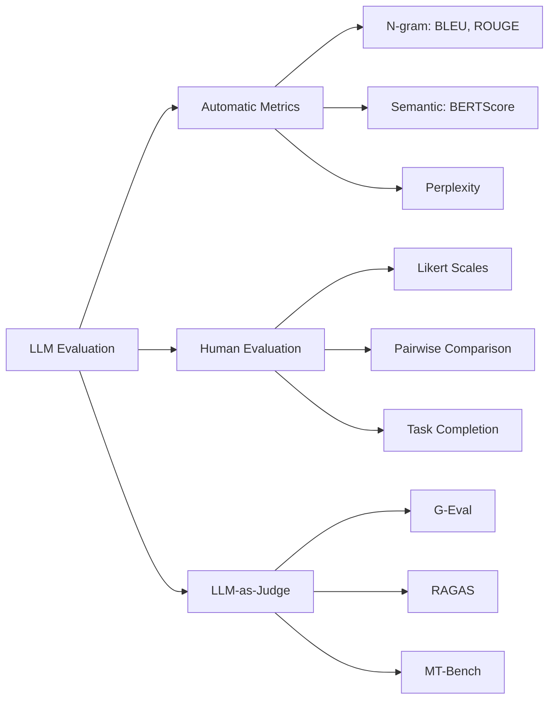
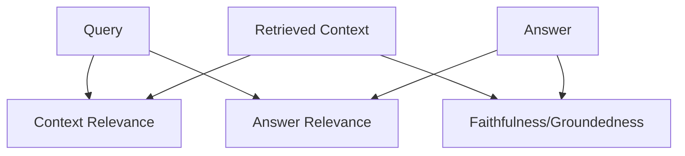

## Overview
Evaluating Large Language Models is fundamentally different from evaluating traditional ML models. Unlike classification (where ground truth is objective) or regression (where error is measurable), LLM outputs are often subjective, creative, and multi-dimensional. There is no single "correct" answer to "Write me a poem about autumn."

LLM evaluation spans multiple dimensions:
- **Accuracy**: Is the information factually correct?
- **Relevance**: Does the output address the query?
- **Fluency**: Is the text grammatically correct and natural?
- **Coherence**: Does the text flow logically?
- **Safety**: Is the output harmful, biased, or toxic?
- **Instruction Following**: Did the model do what was asked?

The challenge is that many of these dimensions are subjective and task-dependent. A metric that works for summarization may be useless for code generation.

## Key Ideas

### The Three Pillars of LLM Evaluation

## Automatic Reference-Based Metrics

These metrics compare the model's output against a known "reference" or "ground truth" answer. They work well when there's a canonical correct answer (translation, summarization).

### BLEU (Bilingual Evaluation Understudy)

Originally designed for machine translation. Measures n-gram overlap between generated text and reference.

$$\text{BLEU} = BP \cdot \exp\left(\sum_{n=1}^{N} w_n \log p_n\right)$$

Where:
- $N$ = maximum n-gram order
- $p_n$ = precision of n-grams (what fraction of generated n-grams appear in reference)
- $w_n$ = weights (typically $\frac{1}{N}$ for uniform weighting)
- $BP$ = Brevity Penalty (penalizes outputs shorter than reference)

$$BP = \begin{cases} 1 & \text{if } c > r \\ e^{(1-r/c)} & \text{if } c \leq r \end{cases}$$

Where $c$ = candidate length, $r$ = reference length.

**Intuition**: "How many chunks of my output also appear in the correct answer?"

**Limitations**:
- Ignores synonyms ("happy" vs "joyful" get no credit)
- Ignores word order importance
- Poor for creative or open-ended tasks
- High scores don't always correlate with human judgment

### METEOR (Metric for Evaluation of Translation with Explicit ORdering)

An improvement over BLEU that addresses synonym matching and word order.

**Alignment Process:**
METEOR aligns words between candidate and reference in priority order:
1. Exact matches (highest priority)
2. Stem matches
3. Synonym matches (via WordNet)

$$\text{METEOR} = F_{mean} \cdot (1 - Penalty)$$

Where:
- $F_{mean}$ = Harmonic mean of precision and recall (weighted toward recall)
- $Penalty$ = Fragmentation penalty based on number of "chunks" needed to align texts

Fragmentation Penalty:

$$Penalty = \gamma \left(\frac{chunks}{matched\ words}\right)^\theta$$

Fewer contiguous chunks = better word order = lower penalty.

### ROUGE (Recall-Oriented Understudy for Gisting Evaluation)

Designed for summarization. Unlike BLEU (precision-focused), ROUGE is **recall-focused**: "How much of the reference appears in my output?"

| Variant | Description                | Use Case            |
| :------ | :------------------------- | :------------------ |
| ROUGE-N | N-gram recall              | General overlap     |
| ROUGE-1 | Unigram recall             | Word coverage       |
| ROUGE-2 | Bigram recall              | Phrase preservation |
| ROUGE-L | Longest Common Subsequence | Sentence structure  |
| ROUGE-S | Skip-bigram (allows gaps)  | Flexible matching   |

$$\text{ROUGE-L} = \frac{(1 + \beta^2) \cdot R_{lcs} \cdot P_{lcs}}{R_{lcs} + \beta^2 \cdot P_{lcs}}$$

Where:
- $R_{lcs} = \frac{LCS(X, Y)}{m}$ (recall)
- $P_{lcs} = \frac{LCS(X, Y)}{n}$ (precision)
- $LCS$ = Longest Common Subsequence length
- $\beta$ = weight for recall vs precision (β > 1 favors recall; typically 1.2 for summarization)

### BERTScore

A **semantic similarity** metric that uses contextual embeddings (BERT) instead of exact string matching.

**How it works:**
1. Encode both candidate and reference with BERT
2. Compute cosine similarity between each token pair
3. Use greedy matching to find optimal alignment
4. Return precision, recall, and F1

$$R_{BERT} = \frac{1}{|x|} \sum_{x_i \in x} \max_{y_j \in y} \mathbf{x}_i^T \mathbf{y}_j$$

$$P_{BERT} = \frac{1}{|y|} \sum_{y_j \in y} \max_{x_i \in x} \mathbf{x}_i^T \mathbf{y}_j$$

$$F_{BERT} = 2 \cdot \frac{P_{BERT} \cdot R_{BERT}}{P_{BERT} + R_{BERT}}$$

**Advantages:**
- Captures semantic similarity ("dog" ≈ "canine")
- Considers context ("bank" in finance vs river)
- Better correlation with human judgment

**Limitations:**
- Computationally expensive
- Still reference-based (needs ground truth)

### Comparison of Reference-Based Metrics

| Metric | Type | Synonym Support | Order Sensitivity | Compute Cost | Best For |
|:-------|:-----|:----------------|:------------------|:-------------|:---------|
| BLEU | N-gram Precision | No | Partial | Low | Translation |
| ROUGE | N-gram Recall | No | Partial (ROUGE-L) | Low | Summarization |
| METEOR | Hybrid | Yes (WordNet) | Yes | Medium | Translation |
| BERTScore | Embedding | Yes (Contextual) | No | High | General semantic |

## Reference-Free Metrics

These metrics evaluate outputs without needing ground truth. Essential for creative or open-ended tasks.

### Perplexity

Measures how "surprised" a language model is by the text. Lower perplexity = more fluent/natural text.

$$\text{Perplexity}(X) = \exp\left(-\frac{1}{N}\sum_{i=1}^{N}\log P(x_i|x_{<i})\right)$$

Where $P(x_i|x_{<i})$ is the probability of token $x_i$ given all previous tokens.

**Intuition**:
- If a model assigns high probability to every token → low perplexity → fluent text
- If a model is constantly surprised → high perplexity → unusual text

**Limitations:**
- Measures fluency, not accuracy or relevance
- A grammatically perfect lie has low perplexity
- Different models have different perplexity scales (not comparable)

**Use Case**: Measuring language model quality, comparing model versions.

## LLM-as-Judge Evaluation

Uses a powerful LLM to evaluate another LLM's outputs. This has become the standard for subjective evaluation.

### How It Works
![[LLM Evaluation Metrics 2025-12-30 22.16.06.excalidraw.svg]]

### G-Eval Framework

A systematic approach using Chain-of-Thought prompting for evaluation.

**Steps:**
1. Define evaluation criteria (coherence, relevance, fluency, etc.)
2. Provide detailed rubric to judge LLM
3. Ask for step-by-step reasoning before scoring
4. Extract numerical score from reasoning

### Pairwise Comparison (Arena Style)

Compares two outputs directly.

**Advantages:**
- Easier for humans and LLMs to judge
- More reliable than absolute scoring
- Basis for Language Model Elo ratings

### Limitations of LLM-as-Judge

| Issue | Description | Mitigation |
|:------|:------------|:-----------|
| **Position Bias** | Prefers first/last option in pairwise | Randomize order, average both orderings |
| **Verbosity Bias** | Prefers longer responses | Explicitly penalize unnecessary length |
| **Self-Enhancement Bias** | GPT-4 prefers GPT-4 outputs | Use different judge than model tested |
| **Sycophancy** | Agrees with user's stated preference | Blind evaluation |
| **Limited Reasoning** | Struggles with math/code verification | Use specialized checkers |

## RAG-Specific Evaluation (RAGAS Framework)

[[01 - RAG Index]] systems require specialized metrics that evaluate both retrieval and generation.

### The RAG Triad

### 1. Context Relevance (Retrieval Quality)

"Is the retrieved context useful for answering the query?"

$$\text{Context Relevance} = \frac{|S_{extracted}|}{|C_{total}|}$$

Where:
- $S_{extracted}$ = Sentences from context relevant to the question
- $C_{total}$ = Total sentences in context

Ask LLM to extract only relevant sentences, then compute ratio.

### 2. Faithfulness / Groundedness

"Is the answer supported by the retrieved context?"
Most critical RAG metric. Measures hallucination.

$$\text{Faithfulness} = \frac{|\text{Claims supported by context}|}{|\text{Total claims in answer}|}$$

1. Extract all claims/statements from the answer
2. For each claim, verify if it can be inferred from the context
3. Calculate ratio of supported claims

### 3. Answer Relevance

"Does the answer actually address the user's question?"

**Implementation:** Generate N hypothetical questions that the answer would be a good response to. Measure semantic similarity between original question and generated questions.

$$\text{Answer Relevance} = \frac{1}{N}\sum_{i=1}^{N} \cos(E(q), E(q_i^{gen}))$$

### RAG Metrics

| Metric | Formula | What It Measures |
|:-------|:--------|:-----------------|
| **Answer Correctness** | Semantic similarity + factual overlap | Overall answer quality |
| **Context Precision** | Relevant chunks / Total chunks | Retrieval precision |
| **Context Recall** | Ground truth covered / Total ground truth | Retrieval coverage |
| **Answer Similarity** | Cosine(answer, ground truth) | Semantic match |

## Human Evaluation

The gold standard, but expensive and hard to scale.

### Evaluation Dimensions

| Dimension           | Description                          |
| :------------------ | :----------------------------------- |
| **Fluency**         | Grammatical correctness, readability |
| **Coherence**       | Logical flow, consistency            |
| **Relevance**       | Addresses the query                  |
| **Informativeness** | Provides useful information          |
| **Harmlessness**    | Avoids harmful content               |
| **Helpfulness**     | Overall utility                      |

### Evaluation Methods

| Method                  | Best For              |
| :---------------------- | :-------------------- |
| **Likert Scales**       | Absolute quality      |
| **Pairwise Comparison** | Relative ranking      |
| **Best-Worst Scaling**  | Efficient ranking     |
| **Task Completion**     | Functional evaluation |

### Inter-Annotator Agreement

Measure consistency between human evaluators:

**Cohen's Kappa:** (Higher is better)

$$\kappa = \frac{p_o - p_e}{1 - p_e}$$

Where:
- $p_o$ = observed agreement
- $p_e$ = expected agreement by chance

## Task-Specific Metrics

### Summarization
- **ROUGE-L**: Longest common subsequence
- **Factual Consistency**: Claims in summary supported by source
- **Compression Ratio**: Summary length / Source length

### Translation
- **BLEU**: N-gram precision
- **COMET**: Neural MT metric (better correlation with humans)
- **chrF**: Character-level F-score

### Question Answering
- **Exact Match (EM)**: Binary correct/incorrect
- **F1**: Token-level overlap with gold answer
- **Accuracy**: For multiple choice

### Dialogue
- **Perplexity**: Fluency
- **Distinct-N**: Diversity
- **Engagement**: Follow-up question rate
- **Task Success Rate**: For goal-oriented dialogue

### Code Generation
- **pass@k**: Functional correctness
- **CodeBLEU**: Syntax + semantic + dataflow match
- **Execution Accuracy**: Output matches expected

## Practical Evaluation Framework

### The Evaluation Stack
![[LLM Evaluation Metrics 2025-12-30 22.12.25.excalidraw.svg]]

### Choosing the Right Metrics

| Task Type | Primary Metrics | Secondary |
|:----------|:----------------|:----------|
| **Translation** | BLEU, COMET | Human preference |
| **Summarization** | ROUGE-L, Faithfulness | BERTScore, Human |
| **RAG/QA** | Faithfulness, Context Relevance, EM | Answer Relevance |
| **Chat/Assistant** | MT-Bench, Human preference | Helpfulness, Harmlessness |
| **Code** | pass@k, Execution | CodeBLEU |
| **Creative Writing** | Human eval, Distinct-N | Perplexity |

### Building an Evaluation Pipeline

TODO - Link Project specific details here.

1. **Define Success Criteria**: What does "good" look like for your task?
2. **Create Golden Dataset**: Hand-curated examples with expected outputs
3. **Layer Metrics**:
   - Automated metrics for CI/CD (fast feedback)
   - LLM-as-Judge for periodic deeper analysis
   - Human evaluation for major releases
4. **Track Over Time**: Monitor metric drift as model changes
5. **A/B Test**: Compare model versions on real users

## Tools & Libraries

| Tool | Purpose | Key Features |
|:-----|:--------|:-------------|
| **RAGAS** | RAG evaluation | Faithfulness, context relevance |
| **TruLens** | LLM observability | Feedback functions, tracing |
| **LangSmith** | LLM debugging | Evaluation datasets, comparison |
| **Weights & Biases** | Experiment tracking | Table comparison, prompts |
| **OpenAI Evals** | Custom benchmarks | Extensible framework |
| **lm-evaluation-harness** | Benchmark suite | 200+ tasks, reproducible |
| **HELM** | Holistic evaluation | Multi-dimensional scoring |
| **DeepEval** | Unit testing for LLMs | Pytest-style assertions |

## Resources

- [Judging LLM-as-a-Judge (LMSYS)](https://arxiv.org/abs/2306.05685)
- [G-Eval: NLG Evaluation using GPT-4](https://arxiv.org/abs/2303.16634)
- [HELM: Holistic Evaluation of Language Models](https://crfm.stanford.edu/helm/)
- [MMLU Paper](https://arxiv.org/abs/2009.03300)
- [BERTScore Paper](https://arxiv.org/abs/1904.09675) 
- [Lost in the Middle](https://arxiv.org/abs/2307.03172)
- [Chatbot Arena](https://lmarena.ai)

---
**Back to**: [[02 - LLMs & Generative AI Index]] | [[ML & AI Index]]
