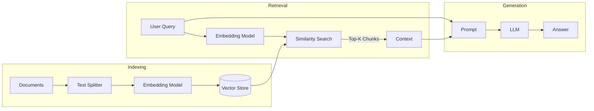

## Overview
**Naive RAG** represents the standard, baseline architecture for Retrieval-Augmented Generation. It follows a strictly linear process: indexing documents into vector embeddings, retrieving the top-$k$ most similar chunks based on a user query, and feeding them directly into the LLM context window.

It is "Naive" because it assumes that **semantic similarity equals ground truth relevance**, which is not always true.

## Key Ideas / Intuition
**The "Ctrl+F on Steroids" Analogy**:
Imagine you have a 1000-page PDF. A standard keyword search (Ctrl+F) looks for exact word matches. Naive RAG looks for *meaning* matches. If you search for "dog", it finds "canine" and "puppy" even if the word "dog" never appears.

### Visual Understanding
The Linear Pipeline:



## The 5-Step Pipeline

### 1. Indexing (Load & Split)
Before we can search, we must prepare the data.
*   **Loading**: Converting raw files (PDF, HTML, Docx) into plain text.
*   **Splitting**: Breaking text into manageable "chunks". LLMs have context limits, and we want to retrieve precise information, not whole chapters.
    *   *Naive Approach*: Split every 500 characters.
    *   *Edge Case*: Splitting a sentence in half destroys its semantic meaning.

### 2. Embedding
We convert text chunks into **vector embeddings**. An embedding is a list of floating-point numbers (e.g., length 1536 for OpenAI `text-embedding-3-small`) that represents the *semantic meaning* of the text in a high-dimensional space.

$$text \xrightarrow{f_\theta} v \in \mathbb{R}^d$$

### 3. Storing
We store these vectors in a **Vector Database** (e.g., Pinecone, Weaviate, FAISS). The database is optimized for **Approximate Nearest Neighbor (ANN)** search, allowing us to find similar vectors among millions in milliseconds.

### 4. Retrieval
When a user asks a question:
1.  Convert the question into a vector $v_q$ using the *same* embedding model.
2.  Calculate the distance between $v_q$ and all stored chunk vectors $v_c$.
3.  Return the $k$ chunks with the highest similarity scores.

### 5. Synthesis (Generation)
We combine the user's query and the retrieved chunks into a prompt template.

> "You are an assistant. Answer the question based ONLY on the following context:
> {context}
> Question: {question}"

## Mathematical Foundation
The core of Naive RAG is **Cosine Similarity**. It measures the cosine of the angle between two non-zero vectors.

$$\text{similarity}(A, B) = \cos(\theta) = \frac{A \cdot B}{||A|| \cdot ||B||} = \frac{\sum_{i=1}^{n} A_i B_i}{\sqrt{\sum_{i=1}^{n} A_i^2} \sqrt{\sum_{i=1}^{n} B_i^2}}$$

*   If $A$ and $B$ are identical, angle is 0, cosine is 1.
*   If they are unrelated (orthogonal), angle is 90°, cosine is 0.
*   *Note*: Normalized vectors ($||A||=1$) allow us to skip the denominator, reducing the calculation to a simple Dot Product ($A \cdot B$).

## Practical Implementation
A minimal Python implementation using `langchain`:

```python
from langchain_community.document_loaders import TextLoader
from langchain_text_splitters import CharacterTextSplitter
from langchain_openai import OpenAIEmbeddings
from langchain_chroma import Chroma
from langchain_openai import ChatOpenAI
from langchain.chains import RetrievalQA

# 1. Load & Split
loader = TextLoader("state_of_the_union.txt")
documents = loader.load()
text_splitter = CharacterTextSplitter(chunk_size=1000, chunk_overlap=0)
texts = text_splitter.split_documents(documents)

# 2. Embed & 3. Store
embeddings = OpenAIEmbeddings()
db = Chroma.from_documents(texts, embeddings)

# 4. Retrieve
retriever = db.as_retriever()

# 5. Generate
qa = RetrievalQA.from_chain_type(llm=ChatOpenAI(), chain_type="stuff", retriever=retriever)
query = "What did the president say about Ketanji Brown Jackson?"
print(qa.do_run(query))
```

## Comparisons (Why "Naive" Fails)
| Problem | Description |
| :--- | :--- |
| **Precision** | Retrieved chunks might refer to the wrong entity (e.g., "Apple" the fruit vs. the company). |
| **Recall** | The answer might need information from multiple distant chunks, but Naive RAG only grabs the top-k individually. |
| **Lost in the Middle** | LLMs tend to ignore information in the middle of a long context window. |
| **Outdated Info** | If the vector DB isn't updated, the model confidently hallucinates based on old data. |

## Resources
*   [LangChain Retrieval](https://python.langchain.com/docs/modules/data_connection/)
*  [The Guide to Vector Databases](https://www.pinecone.io/learn/vector-database/)
*  [OpenAI Cookbook: Question Answering using Embeddings](https://github.com/openai/openai-cookbook/blob/main/examples/Question_answering_using_embeddings.ipynb)

---
**Back to**: [[RAG (Retrieval Augmented Generation) Overview]]
