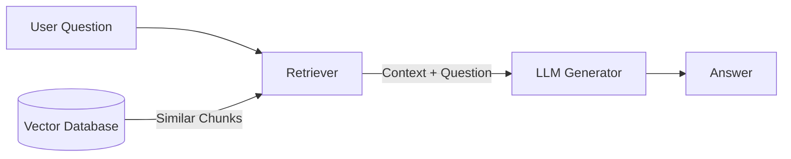

# RAG (Retrieval Augmented Generation) Overview

## Overview
**Retrieval Augmented Generation (RAG)** is a technique that connects a Large Language Model (LLM) to external, private data. Instead of relying solely on the model's internal training data (parametric memory), RAG allows the model to "browse" a curated database (non-parametric memory) to find relevant information before generating an answer.

It bridges the gap between a model's **reasoning capabilities** and your **dynamic, proprietary data**.

## Key Ideas / Intuition

### Visual Understanding
The Standard RAG Flow:

1.  **Retrieval**: The system searches for relevant "chunks" of text.
2.  **Augmentation**: These chunks are pasted into the prompt as context.
3.  **Generation**: The LLM answers the question using the provided context.

## The RAG Learning Path
Follow this curriculum to master RAG, from "Hello World" to agentic systems.

### Phase 1: Foundations
*Measurements: Accuracy, latency.*
*   [[Naive RAG Pipeline]]: The basic "Load -> Split -> Embed -> Store -> Retrieve" loop.
*   **Core Components**:
    *   **Orchestrator**: Chains (LangChain/LlamaIndex).
    *   **Prompt Engineering**: The standard RAG prompt template ("Answer based strictly on the context below").

### Phase 2: The Retrieval Engine (Data Engineering)
*Garbage In, Garbage Out. If you retrieve the wrong text, the LLM cannot save you.*
*   [[Chunking Strategies]]:
    *   **Fixed-size**: Simple character retrieval (e.g., 512 chars).
    *   **Recursive**: Respecting document structure (paragraphs, headers).
    *   **Semantic**: Grouping by meaning.
*   [[Embeddings]]: converting text to vectors ($v \in \mathbb{R}^d$). Understanding MTEB benchmarks.
*   [[Vector Databases]]: Managing the index (HNSW, IVF-Flat).

### Phase 3: Advanced Retrieval
*Improving the signal-to-noise ratio.*
*   [[Hybrid Search]]: Combining Dense Passage Retrieval (Vectors) with Sparse Retrieval (BM25/Keywords) to catch specific terms.
*   [[Query Transformations]]:
    *   **HyDE (Hypothetical Document Embeddings)**: Hallucinating a fake answer to find real documents.
    *   **Multi-Query**: Breaking a complex question into sub-questions.
*   [[Re-ranking]]: Using a Cross-Encoder to re-score the top-K results for higher precision.

### Phase 4: Generation & Synthesis
*   **Context Window Management**: Handling "Lost in the Middle" and token limits.
*   **[[Multi-hop Reasoning]]**: When a single retrieval isn't enough—chaining multiple retrievals to answer complex questions (e.g., "Who founded the company that built X?").
*   **Citation & Attribution**: Techniques to force the LLM to reference specific chunk IDs and their sources.
*   **Compression Techniques**: Using summaries or extractive compression to fit more relevant context into token limits.

### Phase 5: Evaluation
*How do you know it works?*
*   [[RAG Evaluation Metrics]]:
    *   **Context Relevance**: Is the retrieved text actually useful?
    *   **Groundedness/Faithfulness**: Is the answer derived *only* from the context?
    *   **Answer Relevance**: Did we answer the user's question?
*   **Tools**: RAGAS, TruLens.

### Phase 6: The Frontier
*   [[GraphRAG]]: Using Knowledge Graphs to capture structural relationships between entities.
*   [[Agentic RAG]]: Giving an agent tools to decide *when* to search, *what* to search, and if it needs to search *again* (e.g., Self-RAG).

## Mathematical Foundation
Formally, RAG models the probability of generating an output sequence $y$ given input $x$ by marginalizing over retrieved documents $z$:

$$P_{rag}(y|x) \approx \sum_{z \in \text{TopK}(x)} P_{\eta}(y|z, x) P_{\phi}(z|x)$$

Where:
*   $P_{\phi}(z|x)$ is the **Retriever**: Probability of selecting document $z$ given query $x$ (often just the dot product score $E(x)^T E(z)$).
*   $P_{\eta}(y|z, x)$ is the **Generator**: Probability of generating answer $y$ given the context $z$ and query $x$.

## Comparisons

| Feature | Finetuning | RAG | Long Context Window |
| :--- | :--- | :--- | :--- |
| **Knowledge Source** | Internal Weights (Parametric) | External DB (Non-Parametric) | Prompt Context |
| **Data Freshness** | Static (Training snapshot) | Dynamic (Real-time updates) | Dynamic (Per query) |
| **Hallucinations** | Hard to control | Reduced (Grounded) | Reduced |
| **Privacy** | Data baked into model | Data stays in DB | Data sent to API |
| **Cost** | High (Training) | Low (Inference) | Linear with length |
| **Best For** | Domain Vocabulary, Style, Formats | Knowledge retrieval, Facts | Summarizing 1 large doc |

## Common RAG Pitfalls & Challenges

### Retrieval Problems
- **Poor Chunk Quality**: Overlapping or fragmented chunks can confuse the retriever. Solution: Carefully tune chunking strategy.
- **Semantic Drift**: Embedding model mismatches (querying with one model, indexing with another). Solution: Use consistent embeddings throughout.
- **Context Mismatch**: Retrieved context doesn't contain the actual answer because of poor chunking or embedding quality. Measure with Context Relevance metrics.
- **Noise Injection**: Including irrelevant context can mislead the LLM ("Lost in the Middle" effect). Solution: Use re-ranking or stricter filtering.

### Generation Problems
- **Hallucination Outside Context**: LLM generates information not in retrieved documents. Mitigation: Better prompting ("answer only from context") + faithfulness evaluation.
- **Conflicting Information**: Multiple retrieved documents contradict each other. Solution: Use LLM to detect conflicts or re-rank for consensus.
- **Token Overflow**: Too much context → truncation → relevant info lost. Solution: Use compression, hierarchical retrieval, or summary-index pattern.

### Scalability & Performance
- **Latency**: Retrieval adds overhead to inference. Solution: Caching, pre-computation, or Approximate Nearest Neighbor (ANN) optimization.
- **Index Staleness**: If data updates frequently, retrieval might miss recent changes. Solution: Hybrid with live data + caching strategies.

## Use Cases Where RAG Excels
- **Customer Support**: Searching knowledge base / FAQs for relevant answers.
- **Document Q&A**: Querying long contracts, reports, or manuals without losing details.
- **Fact-Based Retrieval**: News summarization, medical records, legal research.
- **Proprietary Knowledge**: Internal company docs, customer data, confidential information.
- **Real-time Information**: Combining current web search results with reasoning.

## Use Cases Where RAG Struggles
- **Creative Tasks**: Requires creativity beyond retrieval + generation (e.g., brainstorming, writing novels).
- **Complex Reasoning**: Multi-step logic that isn't explicitly stated in documents.
- **Conversational Memory**: Maintaining state across turns (use conversation history separately).

## Design Patterns & Trade-offs

### Query Processing Strategy
| Approach | Pros | Cons | Best For |
| :--- | :--- | :--- | :--- |
| **Single Retrieval** | Simple, fast, low cost | Misses multi-hop questions | Simple Q&A |
| **Multi-Query** | Catches more angles | Slower, more tokens | Complex questions |
| **Query Expansion** | Broader coverage | Risk of noise | Rare terms / jargon |
| **Routing** | Efficient (avoids unnecessary retrieval) | Requires classifier training | Intent-based systems |

### Indexing Strategy
- **Flat Index**: All documents in one pool. Simple but doesn't scale.
- **Hierarchical/Summary Index**: Parent summaries → child details. Reduces noise but adds latency.
- **Multi-Vector Index**: Store multiple embeddings per chunk (title, content, summaries). Increases storage but better retrieval.
- **Metadata Filtering**: Index metadata (date, category, author) alongside embeddings. Enables pre-filtering before semantic search.

### Prompt Engineering for RAG
- **In-Context Examples**: Few-shot examples in the prompt improve answer quality.
- **Chain-of-Thought**: Asking the LLM to explain its reasoning reduces hallucinations.
- **Constraints**: "Use only the provided context" + "Cite sources" helps enforce groundedness.
- **Role-Playing**: "You are an expert in X..." can improve specialized domain answers.

## Resources
*  [Retrieval-Augmented Generation for Knowledge-Intensive NLP Tasks (Lewis et al., 2020)](https://arxiv.org/abs/2005.11401) - The original RAG paper.
*  [Pinecone: Generative AI with RAG](https://www.pinecone.io/learn/retrieval-augmented-generation/)
*  [LangChain RAG From Scratch](https://github.com/langchain-ai/rag-from-scratch) - Excellent video series for the learning path.
*  [Lost in the Middle: How Language Models Use Long Contexts](https://arxiv.org/abs/2307.03172)

