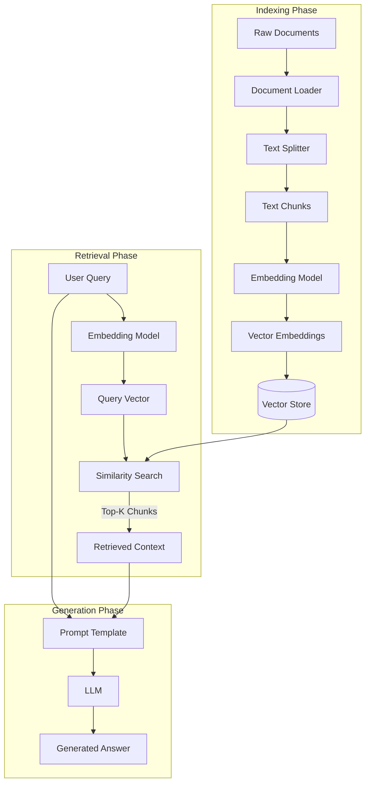

## Overview
**Naive RAG** represents the standard, baseline architecture for Retrieval-Augmented Generation. It follows a strictly linear process: 
1. Indexing documents into vector embeddings
2. Retrieving the top-$k$ most similar chunks based on a user query
3. Feeding them directly into the LLM context window

It is "Naive" because it assumes that **semantic similarity equals ground truth relevance**, which is not always true. It forms the foundation upon which all advanced RAG techniques ([[Hybrid Search]], [[Re-ranking]], [[Agentic RAG]]) are built.

The approach makes several simplifying assumptions that break down in real-world scenarios:
- Assumption 1: The top-$k$ semantically similar chunks contain the answer. *Reality*: Semantic similarity $\neq$ relevance to the question.
- Assumption 2: Chunks are self-contained. *Reality*: Information often spans multiple chunks or requires context from surrounding text.
- Assumption 3: A single retrieval pass is sufficient. *Reality*: Complex questions require multi-hop reasoning across multiple retrievals.

## Linear Pipeline


The entire pipeline is deterministic except for the final LLM generation. Given the same query and the same indexed documents, you will always retrieve the same chunks.

## Pipeline Steps

### Step 1: Document Loading & Parsing
Ingest raw data into a processable format.

- Convert various file formats into plain text
- Extract metadata (filename, page numbers, timestamps, authors)
- Handle special content: tables, images (via OCR or multimodal models), code blocks

TODO( [[Document Parsing]] ) for techniques like LlamaParse and Docling.

### Step 2: Chunking (Text Splitting)
Breaking documents into smaller pieces. Poor chunking is one of the most common causes of RAG failure.

**Why chunk?**
1. Context window limits: LLMs have finite input sizes
2. Retrieval precision
3. Cost: More tokens = more money (retrieving entire documents is wasteful)

**The Overlap Problem**:
Chunks should *overlap* to avoid losing context at boundaries. Typical overlap: 10-20% of chunk size.

```
Chunk 1: [----content A----][overlap]
Chunk 2:                    [overlap][----content B----]
```

Without overlap, a question about content spanning the boundary would fail to retrieve either chunk with high confidence.

See [[Chunking Strategies]] for detailed comparisons.

### Step 3: Embedding
We convert text chunks into vector embeddings.

$$\text{chunk} \xrightarrow{f_\theta} \mathbf{v} \in \mathbb{R}^d$$

Where $f_\theta$ is the embedding model (a neural network with learned parameters $\theta$), and $d$ is the embedding dimension (commonly 384, 768, 1024, or 1536).

Use the same model for both indexing and querying.

### Step 4: Vector Storage & Indexing
Embeddings are stored in a Vector Database optimized for similarity search at scale.

**Challenge**:
Given a query vector $\mathbf{v}_q$, find the $k$ most similar vectors among potentially millions of stored vectors.
This is done using Approximate Nearest Neighbor (ANN) Algorithms.

| Algorithm                                      | How It Works                                               | Trade-off                              |
| :--------------------------------------------- | :--------------------------------------------------------- | :------------------------------------- |
| **HNSW** (Hierarchical Navigable Small Worlds) | Graph-based; builds hierarchical layers for fast traversal | High recall, high memory               |
| **IVF** (Inverted File Index)                  | Clusters vectors; searches only relevant clusters          | Faster indexing, lower recall          |
| **PQ** (Product Quantization)                  | Compresses vectors; trades accuracy for memory             | Low memory, lower accuracy             |
| **ScaNN**                                      | Hybrid of quantization + reordering                        | Google's approach, good accuracy/speed |
TODO(Revisit various ANN algorithms and move below comparision to a separate note)

**Popular Vector Databases**:

| Database     | Type               | Best For                              |
| :----------- | :----------------- | :------------------------------------ |
| **FAISS**    | Library            | Local prototyping, high performance   |
| **Pinecone** | Managed SaaS       | Production, serverless, zero-ops      |
| **Weaviate** | Open-source        | Hybrid search (vectors + keywords)    |
| **Qdrant**   | Open-source        | Filtering, payload storage            |
| **Chroma**   | Open-source        | Simple setup, good for small projects |
| **pgvector** | Postgres extension | When you already use Postgres         |

**Metadata Storage**:
Store metadata alongside vectors for filtering:
This enables queries like: "Find similar chunks from documents published after 2023".

### Step 5: Retrieval
When a user submits a query, we find the most relevant chunks.

1. **Embed the query**: $\mathbf{v}_q = f_\theta(\text{query})$
2. **Search the index**: Find top-$k$ vectors closest to $\mathbf{v}_q$
3. **Return chunks**: Fetch the original text associated with each vector

| $k$ value | Pros                         | Cons                                                                                                           |
| :-------- | :--------------------------- | :------------------------------------------------------------------------------------------------------------- |
| Small     | Precise, less noise, cheaper | May miss relevant information                                                                                  |
| Large     | Higher recall, more context  | More noise, [[Context Window Fundamentals#"Lost in the Middle" Problem\|Lost in the Middle]] effect, expensive |

Ensure to pre-filter by metadata **before** similarity search. (To guarantee `k` closest vectors are metadata-relevant) 

### Step 6: Generation
The retrieved chunks are assembled into a prompt and sent to the LLM.

**A sample RAG Prompt Template**:
```
You are a helpful assistant. Answer the user's question based ONLY on
the following context. If the answer cannot be found in the context,
say "I don't have enough information to answer this question."

Context:
{retrieved_chunks}

Question: {user_query}

Answer:
```

**Prompt Considerations**:
- Grounding instruction - "Answer ONLY based on the context" reduces hallucination
- Uncertainty handling: - Telling the model what to do when context is insufficient
- Request citations - "Cite the source document for each claim" improves verifiability

**Context Window Management**:
If retrieved chunks exceed the context window:
1. **Summarize**: Compress chunks before insertion
2. **Rerank and select**: Use a [[Re-ranking]] model to keep only the most relevant

## Practical Application

### Naive RAG is sufficient for
- **Prototyping**: Quick POC to validate feasibility
- **Simple Q&A**: Single-hop questions with answers contained in one chunk
- **Well-structured data**: Clean documents with clear topic boundaries
- **Limited budget**

### When NOT to Use Naive RAG
- **Multi-hop reasoning**: Questions requiring synthesis across multiple documents (use [[Multi-hop Reasoning]])
- **High-precision domains**: Legal, medical, financial where errors are costly (add [[Re-ranking]])
- **Keyword-sensitive queries**: Specific IDs, codes, names (add [[Hybrid Search]] with BM25)
- **Large-scale production**: When retrieval quality directly impacts business metrics

### Latency & Cost

**Latency**:
Query Embedding and Vector search are generally much faster compared to LLM generation in these pipelines.

**Cost Drivers**:
1. **Embedding API calls**: Per-token pricing
2. **Vector DB hosting**: Storage + queries
3. **LLM tokens**: Input (retrieved chunks) + output (generated answer)

**Potential Optimizations**:
- Cache frequently-asked query embeddings
- Compress/summarize chunks to reduce LLM input tokens
- Batch embedding calls during indexing

## Comparisons

### Why "Naive" Falls Short

| Problem | Description | Advanced Solution |
|:---|:---|:---|
| **Low Precision** | Retrieved chunks might be semantically similar but not actually relevant to the question | [[Re-ranking]] with cross-encoders |
| **Low Recall** | Answer spans multiple chunks or uses different terminology | [[Hybrid Search]], [[Query Transformations]] |
| **Lost in the Middle** | LLMs tend to ignore information in the middle of long contexts | Reorder chunks (important first/last), reduce $k$ |
| **Ambiguity** | "Apple" the fruit vs. the company; "Python" the language vs. the snake | Metadata filtering, [[Contextual Retrieval]] |
| **Multi-hop Failure** | Questions like "Who founded the company that acquired X?" require chained lookups | [[Multi-hop Reasoning]], [[Agentic RAG]] |
| **Stale Data** | Vector DB contains outdated information | Index refresh pipelines, timestamp filtering |

## Resources

- [Retrieval-Augmented Generation for Knowledge-Intensive NLP Tasks (Lewis et al., 2020)](https://arxiv.org/abs/2005.11401) - Original RAG paper
- [Lost in the Middle: How Language Models Use Long Contexts](https://arxiv.org/abs/2307.03172)
- [LangChain: Retrieval](https://python.langchain.com/docs/modules/data_connection/)
- [OpenAI Cookbook: Question Answering using Embeddings](https://github.com/openai/openai-cookbook/blob/main/examples/Question_answering_using_embeddings.ipynb)
- [LangChain RAG From Scratch](https://github.com/langchain-ai/rag-from-scratch)

### Tools & Libraries
- [LangChain](https://github.com/langchain-ai/langchain) - Orchestration framework
- [LlamaIndex](https://github.com/run-llama/llama_index)
- [FAISS](https://github.com/facebookresearch/faiss) - Efficient similarity search

---

**Back to**: [[01 - RAG Index]]
