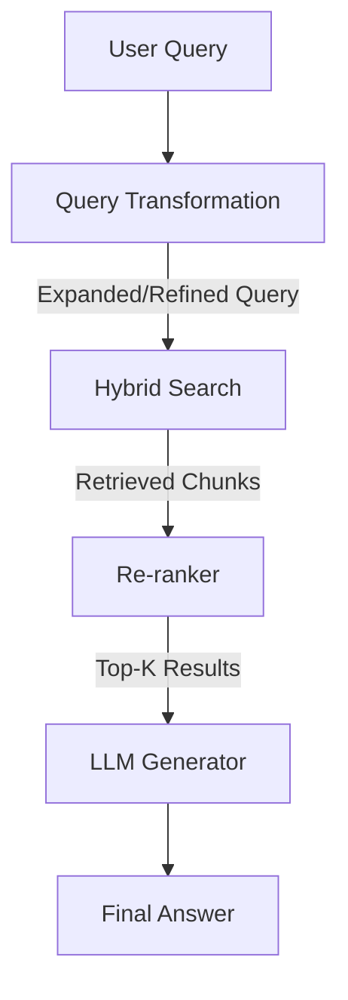

## Overview

**Query Transformations** are preprocessing and expansion techniques applied to user queries *before* retrieval to improve the relevance of retrieved documents. Instead of using the user's raw question as-is, these techniques reframe, expand, or decompose the query to capture different angles, semantic variations, and implicit information.

**Core Insight**: A user's original query is often imperfect, it may be ambiguous, lack context, use different terminology than the indexed documents, or require multiple pieces of information to answer. Query transformations bridge this gap by generating alternative representations of the same intent.

### Why Query Transformations are needed
- **Vocabulary Mismatch**: User asks "How do I fix my car's engine?" but documents use "automotive mechanics" or "mechanical repair"
- **Implicit Intent**: "I'm planning a trip" could need information on flights, hotels, travel guides, weather, visas, etc.
- **Context Loss**: Short queries like "Pricing" lack context about what product, service, or use case is being asked about
- **Semantic Variations**: Same question can be phrased many ways; single embedding may miss some phrasings

## Query Transformation Techniques

### 1. HyDE (Hypothetical Document Embeddings)

Hallucinate a hypothetical answer to the user's question, then use that answer's embedding as the search query instead of the original question's embedding.

**Why It Works**:
- The user's question is often a *query syntax* ("What is X?"), not a *document syntax* ("X is Y because...")
- By generating a plausible answer, we create a hypothetical document that shares vocabulary and semantic structure with real documents in the database
- Embedding space is optimized for document-to-document similarity, not question-to-document similarity

**Example**:
![[Query Transformations 2026-01-10 14.40.16.excalidraw.svg]]


**Strengths**:
- Simple and elegant, leverages LLM's ability to write natural documents
- Works well for factual, answer-seeking questions
- Single forward pass through embedding model

**Limitations**:
- Requires an extra LLM call (latency/cost trade-off)
- Can hallucinate plausible but incorrect details that mislead retrieval
- Less effective for questions without clear "correct answers" (e.g., subjective, creative queries)
- Performance depends on LLM quality and specificity of prompt

**Best For**:
- Factual Q&A ("What is...?", "When did...?", "How does...?")
- Knowledge-intensive tasks
- When latency is not critical

### 2. Multi-Query / Sub-Question Decomposition

Break a complex user query into multiple simpler sub-queries, retrieve results for each, then combine them.

**Why It Works**:
- Complex questions often have multiple implicit sub-questions
- A single vector search may only capture one aspect. Multiple searches cover different angles
- Different sub-queries may match different document clusters

**Example**:
![[Query Transformations 2026-01-10 14.34.17.excalidraw.svg]]


**Strengths**:
- Comprehensive coverage of complex questions
- Can catch information that wouldn't be found with a single query
- Each sub-query is simple and retrieval-friendly
- Works well with multi-hop reasoning scenarios

**Limitations**:
- Multiple LLM calls → higher latency and cost
- Can retrieve redundant or conflicting information
- Requires deduplication/ranking logic
- May over-fetch and increase context length

**Best For**:
- Complex, multi-faceted questions
- Research queries with multiple sub-topics
- Questions requiring synthesis across different domains
- When higher latency/cost is tolerable

### 3. Query Expansion

Augment the original query with synonyms, related terms, and contextual variations while keeping it as a single search query.

**Why It May Work**:
- Expands the "query vocabulary" to match more documents
- Helps with rare or specialized terminology
- Captures semantic cousins of the original terms

**Example**:
```
Original Query: "machine learning algorithms"

Expanded Query: "machine learning algorithms classification models supervised learning
AI pattern recognition neural networks statistical learning data science"

→ Single embedding captures broader semantic space
→ More likely to match documents using alternative terminology
```

**Strengths**:
- Single embedding call (vs multi-query's multiple calls)
- Simple to implement
- Good for terminology-heavy domains
- Balanced latency/coverage trade-off

**Limitations**:
- Can introduce noise by expanding too broadly
- May dilute the original query intent
- Works less well for semantic mismatches (more for vocabulary gaps)
- Embedding model may not weight all terms equally

**Best For**:
- Technical/specialized domains with specific terminology
- When documents use variant terminology
- Simple queries that need modest expansion

### 4. Query Rewriting / Clarification

Rewrite the user's query to be more explicit, removing ambiguity and adding implicit context.

**Why It May Work**:
- Many queries are ambiguous or use pronouns/references that lack context
- Rewriting makes the query's intent explicit and document-like
- Helps with the question-vs-answer syntax mismatch

**Example**:
```
Original Query: "It's not working. How do I fix it?"

Rewritten Query: "My software application is not working properly.
What are the troubleshooting steps I should follow to identify and resolve the issue?"

→ More specific, self-contained, and likely to match technical documentation
```

**Strengths**:
- Handles ambiguous and underspecified queries
- Single retrieval call
- Particularly useful for conversational interfaces
- Can improve context relevance significantly

**Limitations**:
- Requires high-quality LLM for good rewriting
- Can lose nuance if over-generalized
- May not help with true vocabulary gaps

**Best For**:
- Conversational Q&A systems
- User queries that are vague or context-dependent
- When query clarification is the main issue

### 5. Query Routing

**Concept**: Use a classifier to route queries to different retrieval strategies based on query type.

**Why It Works**:
- Different query types benefit from different retrieval approaches
- Classification is fast and cost-effective
- Allows optimization of specific retrieval paths

**Example**:
![[Query Transformations 2026-01-10 14.48.50.excalidraw.svg]]


**Strengths**:
- Efficient: only uses expensive techniques when needed
- Optimizable: can fine-tune each path separately
- Scalable: doesn't degrade with more query types
- Reduces hallucination by using appropriate strategies

**Limitations**:
- Requires training/fine-tuning a classifier
- Misclassification can degrade performance
- Adds complexity to the system
- Cold-start problem with new query types

**Best For**:
- Production systems with diverse query types
- When classifier development is affordable
- Cost-optimized systems where not all queries need expensive processing

### 6. Step-Back Prompting

Ask the LLM to abstract away from specific details and think about the broader concepts/principles before retrieving.

**Why It Works**:
- High-level concepts often have better document representation than specific details
- Helps with bridging vocabulary gaps between user-specific context and document corpus
- Captures fundamental principles that apply broadly

**Example**:
![[Query Transformations 2026-01-10 14.54.33.excalidraw.svg]]


**Strengths**:
- Bridges vocabulary and abstraction gaps
- Effective for finding foundational knowledge
- Can be combined with other techniques
- Works well with principled/conceptual documents

**Limitations**:
- Can lose important specifics
- Requires good LLM for abstraction
- May retrieve overly general documents
- Two retrieval calls increases cost/latency

**Best For**:
- Technical/educational domains
- When specific terminology isn't in documents
- Questions about underlying concepts/principles


## Comparison Table

| Technique             | Latency   | Cost     | Query Complexity        | Best For                 | Key Advantage                 | Main Trade-off                   |
| :-------------------- | :-------- | :------- | :---------------------- | :----------------------- | :---------------------------- | :------------------------------- |
| **HyDE**              | 1-2 calls | Low      | Factual, answer-seeking | Factual Q&A              | Elegant, works well for facts | Can hallucinate details          |
| **Multi-Query**       | 3-5 calls | Medium   | Multi-faceted, complex  | Complex questions        | Comprehensive coverage        | Redundancy, context bloat        |
| **Query Expansion**   | 1 call    | Low      | Terminology gap         | Domain-specific searches | Balanced coverage             | Noise introduction               |
| **Query Rewriting**   | 1 call    | Low      | Ambiguous, vague        | Conversational Q&A       | Handles ambiguity             | May lose nuance                  |
| **Query Routing**     | 1 call    | Very Low | Diverse types           | Production systems       | Efficiency                    | Requires classifier              |
| **Step-Back**         | 2 calls   | Medium   | Concept-based           | Principles/foundations   | Bridges abstraction           | Loses specificity                |


## Integration with the RAG Pipeline

Query transformations sit at the boundary between **query processing** and **retrieval**:



### Connection to Advanced Retrieval Phase
As mentioned in the [[01 - RAG Index#Phase 3 Advanced Retrieval|RAG Overview]], query transformations are part of improving signal-to-noise ratio:

- **Before**: Raw user query → Embedding → Retrieval
  - Problem: Question syntax doesn't match document syntax
  - Problem: Ambiguity and incomplete context

- **After**: Raw user query → **Transform** → Document-like representation → Embedding → Retrieval
  - Benefit: Better matching with document corpus
  - Benefit: Captures multiple angles and implicit information

## Implementation Patterns

### Sequential Transformation
```python
# Apply one transformation after another
def sequential_transform(query, transformers):
    result = query
    for transformer in transformers:
        result = transformer(result)
    return result

# Example: Rewrite → Multi-Query → Expansion
```

### Ensemble Transformation
```python
# Apply multiple transformations in parallel, retrieve for each, combine results
def ensemble_transform(query, transformers):
    results = []
    for transformer in transformers:
        transformed = transformer(query)
        retrieved = retriever.search(transformed)
        results.extend(retrieved)
    return deduplicate_and_rank(results)

# Example: HyDE + Multi-Query + Step-Back in parallel
```

### Adaptive Transformation
```python
# Choose transformations based on query characteristics
def adaptive_transform(query):
    if len(query) < 10:  # Very short query
        return query_expansion(query)
    elif has_ambiguity(query):  # Ambiguous/vague
        return query_rewriting(query)
    elif is_complex(query):  # Multi-faceted
        return multi_query_decomposition(query)
    else:
        return query  # No transformation needed
```


## Trade-offs & Decision Framework

**Use Minimal/No Transformation**:
- ✓ Short, specific, well-defined queries
- ✓ Queries with clear domain terminology
- ✓ When latency is critical
- ✗ Will miss context and variations

**Use Single Transformation (HyDE / Rewriting / Expansion)**:
- ✓ Moderate complexity, single main issue
- ✓ Balanced latency/quality requirement
- ✓ Production systems with cost constraints
- ✗ May miss multiple perspectives

**Use Multiple Transformations (Ensemble)**:
- ✓ Complex, multi-faceted questions
- ✓ Research/comprehensive answers required
- ✓ When latency and cost are acceptable
- ✗ Higher operational complexity

**Use Query Routing**:
- ✓ Diverse query types at scale
- ✓ Production system optimization needed
- ✓ Different query types have very different characteristics
- ✗ Requires classifier development and maintenance

## Practical Considerations

### Deduplication & Ranking
- **Semantic Deduplication**: Use embedding distance or cosine similarity to find near-duplicates
- **Frequency-Based Ranking**: Documents retrieved multiple times are likely more relevant
- **Diversity**: Sometimes want to maintain different perspectives rather than deduplicate everything

### Cost Optimization
- **Caching**: Store common transformations and their results
- **Batching**: When using ensemble approaches, batch LLM calls when possible
- **Selective Application**: Use routing or heuristics to apply expensive transformations only when needed

## Limitations & When Query Transformations Can Hurt

- **Over-Transformation**: Too many transformations → context bloat, contradictions, noise
- **Hallucination Amplification**: Each LLM call risks introducing hallucinations that guide retrieval
- **Semantic Drift**: Transformations can inadvertently change query meaning
- **Vocabulary Explosion**: Query expansion on already-comprehensive queries just adds noise

Start simple, measure retrieval quality metrics ([[RAG Evaluation Metrics]]), and add transformations only where needed.

---

**Back to**: [[01 - ML & AI Concepts/Index]]
