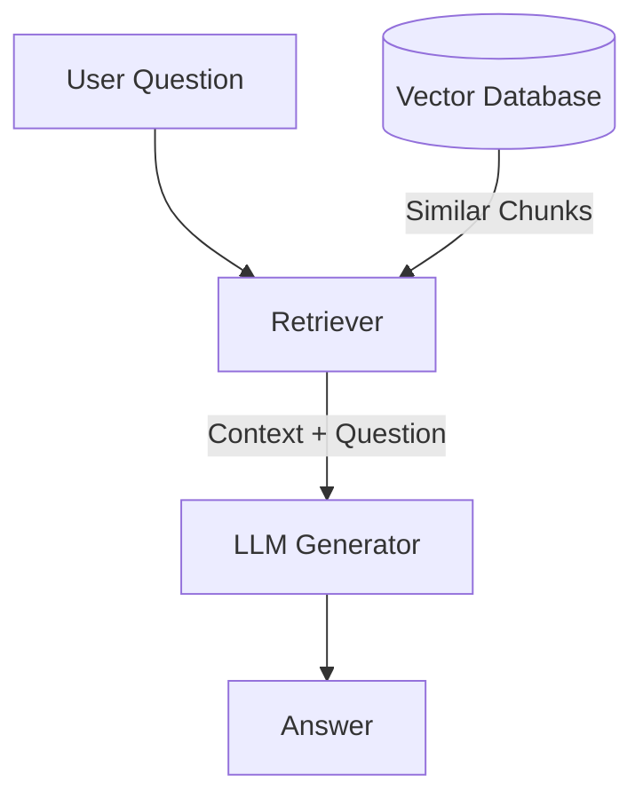

## Overview
RAG (Retrieval Augmented Generation) is a technique that connects a Large Language Model (LLM) to external / private data. Instead of relying solely on the model's internal training data , RAG allows the model to "browse" a curated database to find relevant information before generating an answer.

### Standard RAG Flow

1.  **Retrieval**: The system searches for relevant "chunks" of text.
2.  **Augmentation**: These chunks are pasted into the prompt as context.
3.  **Generation**: The LLM answers the question using the provided context.

### Foundation
*   [[Naive RAG Pipeline]]: The basic "Load -> Split -> Embed -> Store -> Retrieve" loop.
*   Core Components:
    *   **Orchestrator**: LangChain / LlamaIndex
    *   **Prompt Engineering**: Minimizes hallucinations.

### Phase 2: The Retrieval Engine (Data Engineering)
*   [[Document Parsing]](TODO): Extracting text from PDFs, tables, and images before chunking.
*   [[Chunking Strategies]]:
    *   **Fixed-size**: Simple character retrieval
    *   **Recursive**: Respecting document structure.
    *   **Semantic**: Grouping by meaning.
*   [[Embeddings]]: Converting text to embedding vectors. Understanding MTEB benchmarks.
*   [[Vector Databases]]: Managing the index (HNSW, IVF-Flat).

### Phase 3: Advanced Retrieval
*Improving the signal-to-noise ratio.*
*   [[Hybrid Search]]: Combining Dense Passage Retrieval (Vectors) with Sparse Retrieval (BM25/Keywords) to catch specific terms.
*   [[Query Transformations]]:
    *   **HyDE (Hypothetical Document Embeddings)**: Hallucinating a fake answer to find real documents.
    *   **Multi-Query**: Breaking a complex question into sub-questions.
*   [[Re-ranking]]: Using a Cross-Encoder to re-score the top-K results for higher precision.
*   [[Contextual Retrieval]]: Prepending document/section context to chunks before embedding. Significantly improves retrieval accuracy. Related: Late Chunking.

### Phase 4: Generation & Synthesis
*   **Context Window Management**: Handling token limits.
*   **[[Multi-hop Reasoning]]**: When a single retrieval isn't enough—chaining multiple retrievals to answer complex questions (e.g., "Who founded the company that built X?").
*   **Citation & Attribution**: Techniques to force the LLM to reference specific chunk IDs and their sources.
*   **Compression Techniques**: Using summaries or extractive compression to fit more relevant context into token limits.

### Phase 5: Evaluation
*How do you know it works?*
*   [[RAG Evaluation Metrics]]:
    *   **Context Relevance**: Is the retrieved text actually useful?
    *   **Groundedness/Faithfulness**: Is the answer derived *only* from the context?
    *   **Answer Relevance**: Did we answer the user's question?
*   **Tools**: RAGAS, TruLens, Phoenix (Arize).
*   **Synthetic Test Set Generation**: Using LLMs to generate question-answer pairs from your corpus for evaluation. Often the bottleneck in proper RAG evaluation.

### Phase 6: The Frontier
*   [[GraphRAG]]: Using Knowledge Graphs to capture structural relationships between entities.
*   [[Agentic RAG]]: Giving an agent tools to decide *when* to search, *what* to search, and if it needs to search *again* (e.g., Self-RAG).
*   [[Multimodal RAG]]: Embedding and retrieving images, diagrams, and tables. Uses CLIP-style embeddings or vision-language models for document understanding.

## Comparisons

| Feature | Finetuning | RAG | Long Context Window |
| :--- | :--- | :--- | :--- |
| **Knowledge Source** | Internal Weights (Parametric) | External DB (Non-Parametric) | Prompt Context |
| **Data Freshness** | Static (Training snapshot) | Dynamic (Real-time updates) | Dynamic (Per query) |
| **Hallucinations** | Hard to control | Reduced (Grounded) | Reduced |
| **Privacy** | Data baked into model | Data stays in DB | Data sent to API |
| **Cost** | High (Training) | Low (Inference) | Linear with length |
| **Best For** | Domain Vocabulary, Style, Formats | Knowledge retrieval, Facts | Summarizing 1 large doc |

## Common RAG Pitfalls & Challenges

### Retrieval Problems
- **Poor Chunk Quality**: Overlapping or fragmented chunks can confuse the retriever. Solution: Carefully tune chunking strategy.
- **Context Mismatch**: Retrieved context doesn't contain the actual answer because of poor chunking or embedding quality. Measure with Context Relevance metrics.
- **Noise Injection**: Including irrelevant context can mislead the LLM ("Lost in the Middle" effect). Solution: Use [[Re-ranking]] or stricter filtering.

### Generation Problems
- **Hallucination Outside Context**: LLM generates information not in retrieved documents. Mitigation: Better prompting ("answer only from context") + faithfulness evaluation.
- **Conflicting Information**: Multiple retrieved documents contradict each other. Solution: Use LLM to detect conflicts or re-rank for consensus.
- **Token Overflow**: Too much context → truncation → relevant info lost. Solution: Use compression, hierarchical retrieval.

### Scalability & Performance
- **Latency**: Retrieval adds overhead to inference. Solution: Caching, pre-computation, or Approximate Nearest Neighbor (ANN) optimization.
- **Index Staleness**: If data updates frequently, retrieval might miss recent changes. Solution: Hybrid with live data + caching strategies.

### Security Concerns
- **Prompt Injection via Retrieved Content**: Malicious content in your corpus can inject instructions into the LLM context. Mitigation: Sanitize indexed content, use content delimiters, apply output validation.
- **Data Access Control**: Ensuring users only retrieve documents they're authorized to see. Solution: Metadata filtering with user permissions, document-level ACLs.
- **PII Leakage**: Sensitive information in retrieved chunks may be exposed unintentionally. Solution: PII detection/redaction before indexing.

## Where RAG Excels
- **Customer Support**: Searching knowledge base / FAQs for relevant answers.
- **Document Q&A**: Querying long documents without losing details.
- **Fact-Based Retrieval**
- **Real-time Information**: Combining current web search results with reasoning.

## Where RAG Struggles
- **Creative Tasks**: Requires creativity beyond retrieval + generation (e.g. writing novels).
- **Complex Reasoning**: Multi-step logic that isn't explicitly stated in documents.
- **Conversational Memory**: Maintaining state across turns (use conversation history separately).

## Design Patterns & Trade-offs

### Query Processing Strategy
| Approach | Pros | Cons | Best For |
| :--- | :--- | :--- | :--- |
| **Single Retrieval** | Simple, fast, low cost | Misses multi-hop questions | Simple Q&A |
| **Multi-Query** | Catches more angles | Slower, more tokens | Complex questions |
| **Query Expansion** | Broader coverage | Risk of noise | Rare terms / jargon |
| **Routing** | Efficient (avoids unnecessary retrieval) | Requires classifier training | Intent-based systems |

## Production Considerations

### Observability & Monitoring
- **Tracing**: Track the full pipeline (query → retrieval → generation) for debugging.
- **Metrics to Monitor**: Latency (p50/p95/p99), retrieval hit rate, token usage, user feedback signals.
- **Logging**: Store queries, retrieved chunks, and responses for offline analysis.

### Cost Optimization
- **Semantic Caching**: Cache responses for semantically similar queries to reduce redundant LLM calls.
- **Token Budgeting**: Set limits on context size per request. Use compression or summarization when approaching limits.
- **Tiered Retrieval**: Use cheaper/faster retrieval for simple queries, full pipeline for complex ones.

### Deployment Patterns
- **Async Indexing**: Decouple document ingestion from retrieval to avoid blocking.
- **Index Versioning**: Maintain versioned indices for rollback and A/B testing.

## Resources
*  [Retrieval-Augmented Generation for Knowledge-Intensive NLP Tasks (Lewis et al., 2020)](https://arxiv.org/abs/2005.11401) - The original RAG paper.
*  [Pinecone: Generative AI with RAG](https://www.pinecone.io/learn/retrieval-augmented-generation/)
*  [LangChain RAG From Scratch](https://github.com/langchain-ai/rag-from-scratch)
*  [Lost in the Middle: How Language Models Use Long Contexts](https://arxiv.org/abs/2307.03172)
*  [Anthropic: Contextual Retrieval](https://www.anthropic.com/news/contextual-retrieval)

