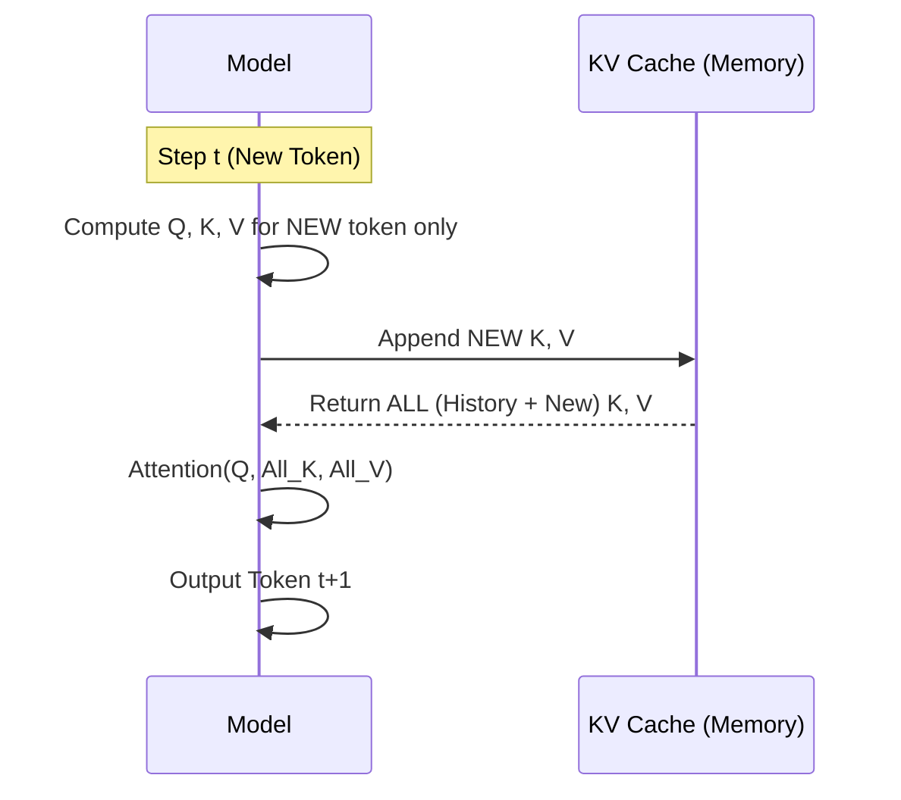
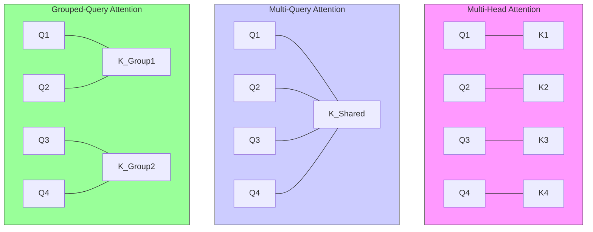

# Token Optimization

## Overview
Token optimization in the context of LLM inference refers to techniques designed to reduce the memory footprint and computational cost of generating text. The primary bottleneck in LLM inference is often **memory bandwidth** (how fast we can move data), not compute. Optimization strategies focus on efficient management of the **KV Cache** (Key-Value Cache) and input/output awareness to increase throughput (tokens per second) and enable larger batch sizes.

## Key Ideas / Intuition
### 1. KV Caching: The Foundation
- **Problem**: In an autoregressive model (like GPT), generating the token at step $t$ requires attending to all previous tokens $0$ to $t-1$. Re-computing the Key and Value matrices for the entire history at every step is wasteful.
- **Solution**: Cache the Key and Value vectors for past tokens. At each step, we only compute the K and V for the *new* token and append them to the cache.
- **Visual**:

### 2. FlashAttention
- **Problem**: Standard attention computes an $N \times N$ matrix. For long sequences, this matrix is too huge to fit in the GPU's fast SRAM, so it constantly reads/writes to slower HBM (High Bandwidth Memory).
- **Solution**: **Tiling** and **Recomputation**. It breaks the calculation into small tiles that *do* fit in SRAM, computes them, and writes only the final result to HBM. It re-computes parts of the attention during the backward pass to save memory.
- **Intuition**: Cooking a meal in a tiny kitchen (SRAM) vs a huge pantry (HBM). Standard attention runs back and forth to the pantry for every single ingredient. FlashAttention grabs a basket of ingredients, cooks a whole dish in the kitchen, and only walks back to the pantry to serve it.

### 3. PagedAttention (vLLM)
- **Problem**: The KV cache grows dynamically. Allocating contiguous memory blocks leads to **fragmentation** (wasted space) and over-reservation.
- **Solution**: Inspired by OS virtual memory. Break the KV cache into fixed-size "blocks" (pages) that can be stored in non-contiguous memory.

### 4. Speculative Decoding
- **Problem**: Generating tokens is serial and memory-bound. GPU compute cores often sit idle waiting for memory.
- **Solution**: Use a tiny, fast "draft" model to guess the next $K$ tokens cheaply. Then, run the massive "target" model to verify all $K$ tokens in a single parallel pass.
- **Intuition**: A junior writer (draft model) quickly types out a paragraph. The senior editor (target model) reads it all at once and marks where the junior went wrong. Most of the time, the junior is right, saving the editor's time.

### 5. Multi-Query & Grouped-Query Attention (MQA / GQA)
- **Problem**: Loading the huge KV cache from HBM is slow. MHA has a unique KV head for every Query head.
- **Solution (MQA)**: Share *one* KV head across *all* Query heads.
- **Solution (GQA)**: Divide Query heads into "groups" and share one KV head per group.

## Mathematical Foundation

### KV Cache Size Calculation
The memory required to store the KV cache for a **single** request is:

$$
\text{Mem}_{KV} = 2 \times L \times H_{kv} \times D_{head} \times S \times P_{\text{bytes}}
$$

### FlashAttention Speedup
- **Standard Attention**: $\mathcal{O}(N)$ HBM accesses (linear with sequence length for memory IO).
- **FlashAttention**: $\mathcal{O}(N^2 / M)$ HBM accesses (where $M$ is SRAM size). By making $M$ relevant, we drastically reduce the bottleneck.
- **Result**: often 2-4x faster wall-clock time for long sequences.

### Speculative Decoding Efficiency
- If draft model takes $t_d$ time per token and target model takes $t_m$ for a parallel forward pass:
- **Speedup** occurs if $K \times t_d < t_m$ (drafting is fast enough) and acceptance rate $\alpha$ is high.

## Practical Application

### Throughput vs. Latency
- **Optimization**: PagedAttention and Continuous Batching allow us to pack more concurrent requests into the same GPU memory.
- **Sliding Window Attention**: (Used in Mistral) Only attend to the last $W$ tokens. Caps the specific KV cache size to $W$, regardless of sequence length $S$.

### KV Cache Quantization
- **FP16** (Default): 2 bytes per parameter.
- **FP8 / Int8**: Compresses KV cache to 1 byte or less. Crucial for very long context windows (100k+ tokens). Minimal accuracy loss for widespread gains in capacity.

### Comparisons: Attention Variants

| Feature          | Multi-Head (MHA)        | Multi-Query (MQA)          | Grouped-Query (GQA)         |
| :--------------- | :---------------------- | :------------------------- | :-------------------------- |
| **Ratio**        | 1:1 (Q:KV)              | N:1 (All Q share 1 KV)     | G:1 (Group of Q share 1 KV) |
| **Memory Usage** | High (Huge Cache)       | Lowest                     | Low                         |
| **Quality**      | Best                    | Can degrade                | Near-MHA                    |
| **Use Case**     | Training / Small Models | Extreme Speed Requirements | Llama 2/3, Mistral          |

## Resources
- **Papers**:
    - [FlashAttention: Fast and Memory-Efficient Exact Attention with IO-Awareness](https://arxiv.org/abs/2205.14135)
    - [Speculative Sampling](https://arxiv.org/abs/2302.01318)
    - [Efficient Memory Management with PagedAttention](https://arxiv.org/abs/2309.06180)
- **Articles**:
    - [vLLM Blog Post](https://vllm.ai/)
    - [HuggingFace: Optimizing LLMs for Speed and Memory](https://huggingface.co/docs/transformers/llm_tutorial_optimization)

**Back to**: [[02 - LLMs & Generative AI Index]]
