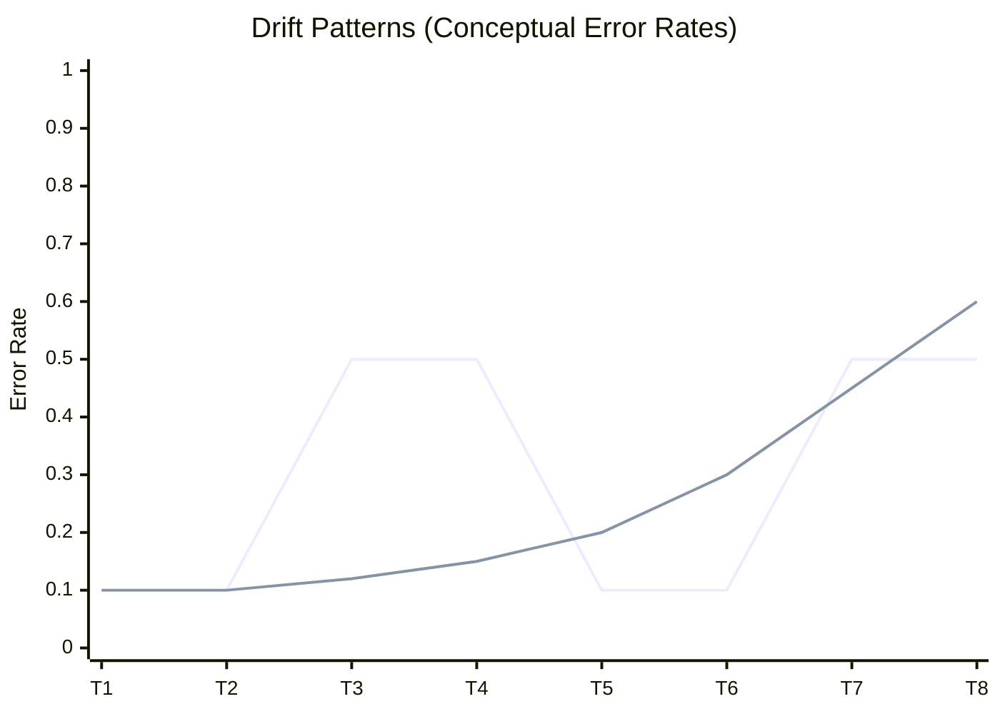

# Concept Drift

## Overview
**Concept Drift** occurs when the statistical relationship between the input data $X$ and the target variable $Y$ changes over time. In probabilistic terms, the posterior distribution $P(Y|X)$ changes.

Unlike Data Drift (where the *inputs* change), Concept Drift means the *meaning* of the data has changed. A model trained on historical data becomes invalid because the rules of the world have shifted.

## Key Ideas / Intuition
-   **"The World Has Changed"**: The same user behavior that used to mean "Safe" now means "Fraud".
-   **Same Input, Different Label**: If you feed exactly the same $X$ into the world today, you get a different $Y$ than you did yesterday.
-   **Label Latency**: The hardest part about detecting Concept Drift is that you need the *ground truth* (actual labels) to know it's happening. If labels arrive weeks later (e.g., loan default), your drift detection lags by weeks.

### Visual Intuition
Imagine a binary classification problem (Spam vs. Not Spam).
-   **Yesterday**: The decision boundary was a vertical line. Keyboards were just keyboards.
-   **Today**: Scammers found a new trick. The decision boundary *rotates*. Keyboards with specific patterns are now "Spam".

## Mathematical Foundation
Formally, Concept Drift is defined as a change in the joint distribution $P(X, Y)$ such that:
$$ P_{t0}(X, Y) \neq P_{t1}(X, Y) $$
Where the change is specifically driven by the conditional probability:
$$ P_{t0}(Y|X) \neq P_{t1}(Y|X) $$
while the marginal distribution $P(X)$ (the input distribution) *may or may not* change.

### Decomposition
$$ P(X, Y) = P(Y|X) \cdot P(X) $$
-   **Concept Drift**: Change in $P(Y|X)$. (The mapping changes).
-   **Data Drift (Covariate Shift)**: Change in $P(X)$. (The inputs change).

## Types of Drift
Understanding the *speed* and *shape* of the drift dictates how you handle it.

### 1. Sudden Drift (Abrupt)
The concept switches overnight.
-   **Example**: COVID-19 lockdowns. Suddenly, "buying masks" went from niche to essential.
-   **Detection**: Easy to spot if you have labels. Error rate spikes instantly.
### 2. Gradual Drift
The new concept replaces the old one over time.
-   **Example**: Inflation. \$100 buys less and less over years.
-   **Detection**: Harder. Looks like noise at first.
### 3. Incremental Drift
The concept shifts continuously in one direction.
-   **Example**: A sensor degrading/wearing out. Readings drift linearly.
### 4. Recurring Drift (Seasonal)
Old concepts return.
-   **Example**: "Holiday Shopping" behavior returns every December.
-   **Strategy**: Don't retrain! Switch to the "Holiday" model.

*(Note: light line represents recurring/sudden shifts, dark line represents gradual decay).*

## Practical Application: Detection
Since Concept Drift requires $Y$ (Labels), we often use **Error Rate Monitoring**.

### 1. DDM (Drift Detection Method)
Based on the Binomial distribution. It models the error rate as a random variable.
-   **Mechanism**: Tracks the specific Error Rate ($p_{min}$) and Standard Deviation ($s_{min}$).
-   **Alerts**:
    -   **Warning Level**: If error $> p_{min} + 2s_{min}$. (Prepare to retrain).
    -   **Drift Level**: If error $> p_{min} + 3s_{min}$. (Reset model).

### 2. ADWIN (Adaptive Windowing)
Uses a sliding window of variable size.
-   **Mechanism**: Automatically shrinks the window when data changes (to discard old, irrelevant data) and grows it when data is stable (to increase statistical power).
-   **Pro**: No need to set a fixed "window size" hyperparameter.

### 3. Proxy Detection (Zero-Label)
When you don't have immediate labels (e.g., Credit Default takes months), you check proxies:
-   **Prediction Confidence**: Is the model becoming "unsure"? (e.g., $P(\text{class}) \approx 0.5$ more often).
-   **Data Drift**: If $P(X)$ drifts significantly, $P(Y|X)$ likely shifted too. (High correlation).

## Industry Standards & Advanced MLOps
Modern production systems require more than just basic error monitoring.

### 1. LLM & Generative AI Drift
Concept drift in GenAI is harder to quantify because $Y$ (output text) is unstructured.
-   **Behavior Drift**: The model becomes "lazier", more verbose, or changes tone.
-   **Alignment Drift**: Safety guardrails degrade (e.g., "Jailbreak" prompts start working).
-   **Detection Strategy**:
    -   **Canary Prompts**: Run a fixed set of 100 prompts every day. If the responses change significantly (measured by Embedding Distance), alert.
    -   **Embedding Drift**: Monitor the distribution of *input embeddings*. If users ask about new topics (e.g., specific to a breaking news event), the cluster moves.

### 2. Feedback Loop Architecture
Solving **Label Latency** (the time gap between Prediction and Ground Truth) is the #1 engineering challenge.
-   **Golden Sets**: Manually labeled "Test Sets" that are run against the production model every hour.
-   **Human-in-the-Loop (HITL)**: Send low-confidence predictions to human labelers *immediately* to get ground truth faster than waiting for organic labels.

### 3. Feature Store Integration
Drift often originates upstream in the data pipelines.
-   **Online/Offline Skew**: A form of drift where the *Feature Store* serving logic (Online) differs from the Data Warehouse training logic (Offline).
-   **Shift-Left Detection**: Detect drift at the Feature Store level (using tools like `Feast` or `Tecton`) before the invalid feature even reaches the model.

## Handling / Adaptation Strategies
Once drift is detected, you must adapt.

1.  **Retraining (The Default)**:
    -   **Fixed Window**: Train on last N months.
    -   **Sliding Window**: Drop oldest month, add newest month.
2.  **Online Learning**:
    -   Update the model *incrementally* with every new sample.
    -   **Good for**: High-velocity streaming data.
    -   **Library**: `River` (Python).
3.  **Ensembles**:
    -   **Weighted Ensemble**: Train 5 models on different time windows. Weigh the most recent models higher.
4.  **Domain Adaptation**:
    -   Techniques to align the source distribution (training) to the target distribution (production) mathematically.
5.  **Safe Deployment Strategies**:
    -   **Shadow Mode**: Deploy the new "Drift-Corrected" model alongside the old one. It receives traffic but returns nothing to user. Compare its logs to ground truth to prove it's better.
    -   **A/B Testing**: Send 5% of traffic to the new model. If business metrics (Click-through rate) improve, roll out.

## Comparisons

| Feature | Data Drift (Covariate Shift) | Concept Drift | Prior Probability Shift |
| :--- | :--- | :--- | :--- |
| **Math** | $P(X)$ changes | $P(Y\|X)$ changes | $P(Y)$ changes |
| **Labels Needed?** | No (Unsupervised) | **Yes** (Supervised) | Yes (to verify) |
| **Cause** | Population change, broken sensor | Logic change, competitor action | Class imbalance shift |
| **Impact** | Model *might* fail | Model *will* fail | Bias in predictions |
| **Fix** | Reweight samples, Retrain | Retrain, Online Learning | Recalibrate bias |

## Resources
-   **Papers**:
    -   [Learning under Concept Drift: An Overview](https://arxiv.org/abs/1010.4784) (Gama et al.)
-   **Libraries**:
    -   [River](https://github.com/online-ml/river) (Online machine learning in Python).
    -   [scikit-multiflow](https://scikit-multiflow.github.io/) (Legacy, merged into River).
    -   [EvidentlyAI](https://www.evidentlyai.com/) (For monitoring).
-   **Articles**:
    -   [Machine Learning Engineering for Production (Coursera) - Drift Section](https://www.coursera.org/learn/machine-learning-data-lifecycle)

## Personal Notes
<!-- User thoughts -->

## Progress Checklist
- [ ] Read overview and definition
- [ ] Understand key difference from Data Drift ($P(Y|X)$ vs $P(X)$)
- [ ] Review types of drift (Sudden, Gradual)
- [ ] Learn detection methods (DDM, ADWIN)
- [ ] Hands-on: Try `river` for online learning
- [ ] Can explain to others

**Back to**: [[03 - MLOps & Infrastructure Index]]
