## Overview
Data Drift (or **Covariate Shift**) refers to the change in the distribution of input data $P(X)$ over time, while the relationship between inputs and outputs $P(Y|X)$ remains constant. It is a silent killer of ML models in production, as models trained on a specific historical distribution (Reference) may fail to generalize to a new, shifted distribution (Current).

- **"Silent" Degradation**: Unlike system failures, data drift doesn't crash the pipeline. It just makes the model's predictions gradually worse or confidently wrong.
- **Reference vs. Current**: Drift detection always compares two windows:
    - **Reference Window**: The training dataset or a golden validation set (representing "normal").
    - **Current Window**: The live production data from a recent period (e.g., last hour, last day).
- **Two Sample Problem**: All drift detection methods essentially ask: "Do these two samples come from the same distribution?"

Imagine a histogram of user ages in your training data (mostly 20-30 year olds). If your production traffic suddenly shifts to mostly 50-60 year olds, the "shape" of the histogram moves to the right. That "movement" is the drift.

## Mathematical Foundation
To quantify drift, we measure the distance between the reference probability distribution $P$ and the current distribution $Q$.
### 1. Kullback-Leibler (KL) Divergence
A measure of how one probability distribution differs from a second, expected probability distribution. In drift detection, $P$ is typically the **Reference** (training) distribution, and $Q$ is the **Current** (production) distribution.

$$ D_{KL}(P || Q) = \sum_{i} P(i) \ln \frac{P(i)}{Q(i)} $$

- **Intuition**: Measures the information lost when $Q$ is used to approximate $P$.
- **MLOps Implementation Details**:
    - **Binning Strategy**: KL requires discrete probability distributions. Continuous features **must** be binned (discretized) first. The number of bins is a critical hyperparameter; too few hides drift, too many creates noise.
    - **"Zero Probability" Problem**: If $Q(i) = 0$ (category present in Training but missing in Production), the term explodes to infinity.
	    - **Smoothing Solution**: We apply **Epsilon Smoothing** (add constant $\epsilon \approx 10^{-6}$) to all bins to ensure non-zero probabilities.

#### 1.1 Practical Example
Let's calculate the drift for a feature **"User Device"** (Mobile vs. Desktop).

**Scenario**:
- **Reference ($P$)**: In training, 10% of users were on Mobile, 90% on Desktop.
- **Current ($Q$)**: In production, 50% are on Mobile, 50% on Desktop.

**Visual Representation**:

```mermaid
xychart-beta
    title "Distribution Shift: Device Type"
    x-axis ["Mobile", "Desktop"]
    y-axis "Probability" 0.0 --> 1.0
    bar [0.1, 0.9]
    bar [0.5, 0.5]
```

*(Note: The first bar is Reference and the second overlapping bar is Current. The drastic change in height represents drift.)*

$$ D_{KL} = \sum P(i) \ln \frac{P(i)}{Q(i)} $$
1.  **Mobile Bin**:
    $$ 0.1 \times \ln(\frac{0.1}{0.5}) = 0.1 \times \ln(0.2) \approx 0.1 \times (-1.61) = -0.161 $$
2.  **Desktop Bin**:
    $$ 0.9 \times \ln(\frac{0.9}{0.5}) = 0.9 \times \ln(1.8) \approx 0.9 \times (0.59) = 0.531 $$
    $$ D_{KL} = -0.161 + 0.531 = \mathbf{0.37} $$

**Interpretation**:
- A result of **0.0** means perfect match (No Drift).
- A result of **0.37** is significant drift.
- Because $P(Desktop)$ had high weight (0.9), the shift there contributed most to the score.

#### 1.2 Thresholds: What is "Significant"?
KL Divergence has no universal threshold.

1.  **Heuristics**:
    - Small drift: $< 0.1$
    - Significant drift: $> 0.2$ (Typical alert threshold)
    - *Warning*: These values depend heavily on the number of bins. More bins = Higher "natural" KL.
2.  **"Noise Floor" Strategy (Best Practice)**:
    - Calculate the KL Divergence between two **healthy** validation sets (e.g., Week 1 data vs. Week 2 data).
    - If the "normal" variance is roughly 0.02, set alert threshold at $3 \times$ that noise floor (0.06).
    - This is **Dynamic Thresholding**.

- **Note**: It is asymmetric ($D_{KL}(P || Q) \neq D_{KL}(Q || P)$) and not a true distance metric.
- **When to use**: Detecting drift in categorical features or binned continuous features.

### 2. Kolmogorov-Smirnov (KS) Test
A non-parametric test that compares the cumulative distribution functions (CDF) of two samples.

$$ D_{KS} = \sup_{x} | F_{P}(x) - F_{Q}(x) | $$
- **Intuition**: It finds the maximum vertical distance between the two CDF curves. If this distance is large enough (based on a p-value), we reject the null hypothesis that they come from the same distribution.
- **When to use**: Continuous numerical features. It is robust to scale changes.

### 3. Population Stability Index (PSI)
A popular metric in credit risk scoring (finance) to measure the stability of model scores or features.

$$ PSI = \sum_{i=1}^{B} (P_i - Q_i) \ln \frac{P_i}{Q_i} $$
where $B$ is the number of bins, $P_i$ is the actual proportion in bin $i$, and $Q_i$ is the expected proportion.
- **Thresholds**:
    - $PSI < 0.1$: No significant drift.
    - $0.1 \le PSI < 0.25$: Moderate drift (investigate).
    - $PSI \ge 0.25$: Significant drift (retrain).

### 4. Wasserstein Distance (Earth Mover's Distance)
Measures the minimum amount of "work" required to transform one distribution into the other.

$$ W_1(P, Q) = \inf_{\gamma \in \Gamma(P, Q)} \mathbb{E}_{(x, y) \sim \gamma} [|x - y|] $$

- **Intuition**: If the distributions were piles of dirt, how much dirt x distance do you need to move?
- **Pro**: Handles disjoint support better than KL (which blows up if $Q(i)=0$).

## Practical Application
### Methods of Detection
1.  **Univariate Drift** (see [[Feature Drift]]): Checking every feature individually.
    - *Pro*: Pinpoints exactly *which* feature broke.
    - *Con*: Can trigger too many alerts (False Positive hell) if features are correlated.
2.  **Multivariate Drift**: using a separate model (e.g., an Autoencoder or a Binary Classifier) to discriminate between Reference and Current data.
    - *Method*: Train a classifier to distinguish Train vs. Production data. If ROC-AUC >> 0.5, the data is distinguishable, hence drifted.

### Handling Seasonality
Don't confuse weekly patterns with drift. If traffic dips on weekends, compare "This Sunday" vs "Last 4 Sundays", not "This Sunday" vs "This Monday".

## Comparisons

| Type                        | Definition                      | Example                                                      |
| :-------------------------- | :------------------------------ | :----------------------------------------------------------- |
| **Covariate Shift**         | $P(X)$ changes, $P(Y\|X)$ same. | Users get older, but age->risk relationship is same.         |
| **Prior Probability Shift** | $P(Y)$ changes, $P(X\|Y)$ same. | Spam emails become more frequent (surge), content same.      |
| **Concept Drift**           | $P(Y\|X)$ changes.              | Definition of "spam" changes; same email content, new label. |

## Resources
- **Papers**: [Failing Loudly: An Empirical Study of Methods for Detecting Dataset Shift](https://arxiv.org/abs/1810.11953)
- **Libraries**:
    - [EvidentlyAI GitHub](https://github.com/evidentlyai/evidently)
    - [Alibi Detect](https://github.com/SeldonIO/alibi-detect)
- **Articles**: https://medium.com/@anicomanesh/model-drift-identifying-and-monitoring-for-model-drift-in-machine-learning-engineering-and-0f74b2aa2fb0 

**Back to**: [[03 - MLOps & Infrastructure Index]]
