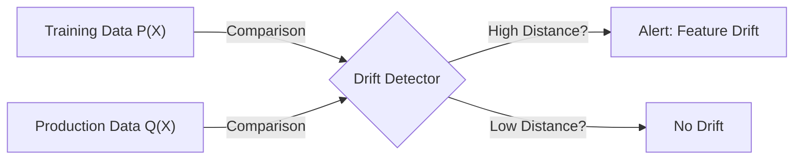
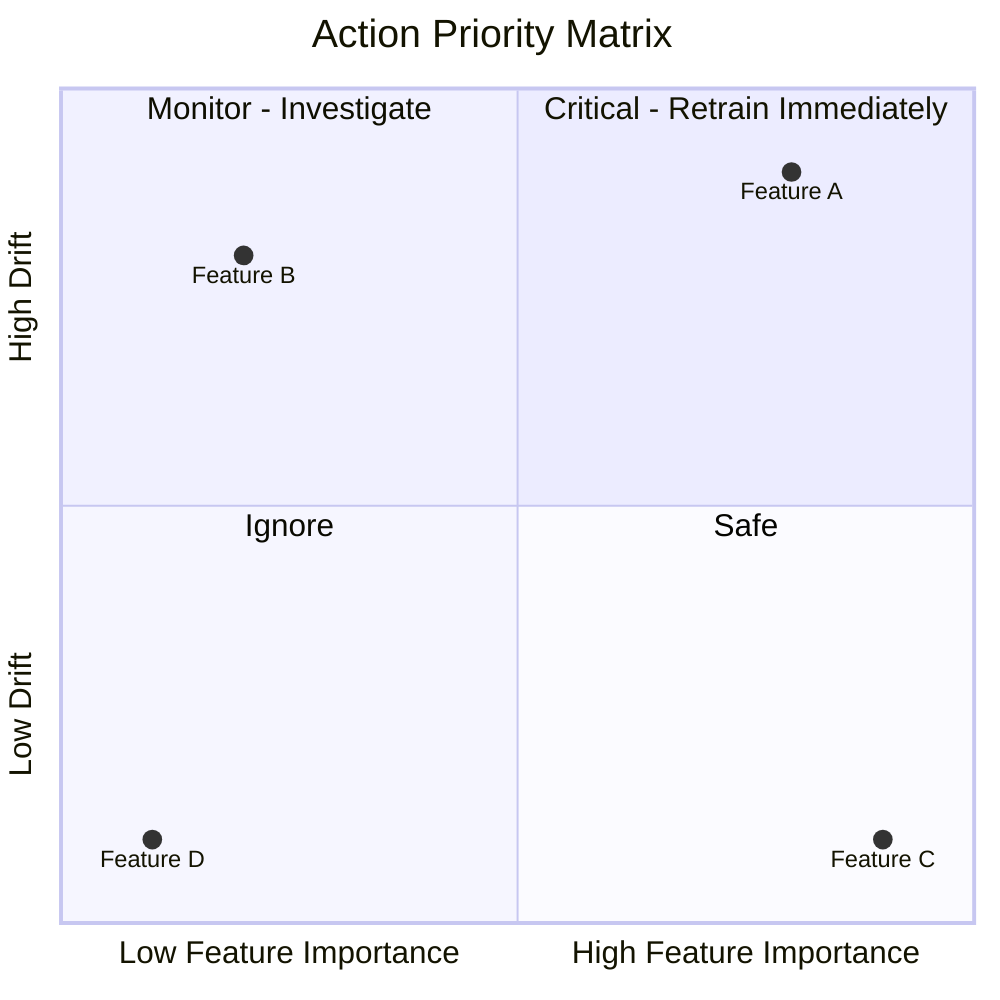

# Feature Drift

## Overview
**Feature Drift** (often a component of **Covariate Shift**) occurs when the distribution of one or more independent input features $P(X_i)$ changes significantly over time, while the mapping to the target variable $P(Y|X)$ remains static. 

In MLOps, this is the "Check Engine" light: it doesn't guarantee the car is broken (model performance might stay high if the drifting feature is unimportant), but it signals that the environment is changing.

## Key Ideas / Intuition
- **The "Input" Problem**: The model is being asked to make predictions on data that looks different from what it studied.
- **Granularity**: Unlike generic "Data Drift" which might look at the dataset as a whole, **Feature Drift** focuses on specific columns (e.g., "Age", "Income", "Pixel Intensity").
- **Drift $\neq$ Failure**: A feature can drift wildly (e.g., "User ID" increments over time), but if the model doesn't rely on it, performance won't suffer.
- **Importance Matters**:
    - **High Impact**: Drift in a top feature (e.g., "Credit Score" in a loan model) is critical.
    - **Low Impact**: Drift in a noise feature (e.g., "Timestamp") is expected.

### Visual Intuition
Consider a feature `Hours_Active_Per_Day`.
- **Training**: Gaussian distribution centered at 4 hours.
- **Production (Week 1)**: Still centered at 4 hours.
- **Production (Week 10)**: Bimodal distribution with peaks at 2 hours and 8 hours. 
The *mean* might be the same (5), but the *shape* has fundamentally changed.

## Mathematical Foundation
We treat each feature as a random variable $X_i$ and compare its probability density function (PDF) or probability mass function (PMF) between two time windows.

### 1. Numerical Features (Continuous)
For continuous features (e.g., Price, Temperature), we compare Cumulative Distribution Functions (CDFs) or binned PDFs.
- **Wasserstein Distance ($W_1$)**: Robust to non-overlapping supports.
- **Kolmogorov-Smirnov (KS) Test**:$$ D_{KS} = \sup_x |F_{ref}(x) - F_{curr}(x)| $$
    Good for detecting shifts in the *center* or *spread*.

### 2. Categorical Features (Discrete)
For discrete features (e.g., State, Color), we compare the relative frequency of categories.
- **Chi-Square Test ($\chi^2$)**:$$ \chi^2 = \sum \frac{(O_i - E_i)^2}{E_i} $$
    Where $O$ is observed frequency (current) and $E$ is expected (reference).
- **L-Infinity Norm ($L_\infty$)**: The maximum difference in probability for any single category.$$ L_\infty(P, Q) = \max_k |P_k - Q_k| $$
## Practical Application
### The "Drift-Importance" Matrix
In MLOps dashboards, simply listing all drifting features is noisy. The industry standard is to plot **Drift Magnitude** vs. **Feature Importance**.

- **Quadrant 1 (Top Right)**: High Importance + High Drift. **CRITICAL**.
- **Quadrant 2 (Top Left)**: Low Importance + High Drift. Likely data quality issue or upstream schema change.
- **Quadrant 3/4**: Low Drift. Business as usual.

### Detection in Unstructured Data (Embeddings)
Modern MLOps (GenAI/LLMs) deals with text and images where single "columns" don't exist.
- **Problem**: You cannot measure drift on 768 dimensions individually.
- **Solution (Embedding Drift)**:
    1.  **Dimensionality Reduction**: Project high-dim embeddings to 2D/3D using UMAP/PCA. Measure drift on the components.
    2.  **Model-Based Drift**: Train a binary classifier to distinguish Reference Embeddings from Current Embeddings. If Accuracy $> 0.5$, drift exists.

### Common Pitfalls
1.  **False Positives from Seasonality**: A feature `Is_Weekend` will "drift" every Monday if your window is too short (e.g., 24 hours).
    - *Fix*: Align windows with seasonality (compare "This Monday" to "Last Monday").
2.  **Schema Change vs. Drift**:
    - *Drift*: Distribution changes (Int $\to$ Int).
    - *Schema Change*: Type changes (Int $\to$ String) or Unit changes (Meters $\to$ Feet). This is a data quality error, not statistical drift.

## Comparisons

| Concept | Scope | Method | Action |
| :--- | :--- | :--- | :--- |
| **Feature Drift** | Single Input Column ($X_i$) | KS-Test, Chi-Square, PSI | Check upstream data, Feature Selection |
| **Data Drift** | All Inputs (Joint $P(X)$) | Model-based, Mean Embedding distance | Retrain, Re-weight samples |
| **Target Drift** | Output Labels ($Y$) | Label distribution comparison | Calibrate model bias |

## Resources
- **Papers**: [Quantifying the Impact of Concept Drift on Machine Learning Models](https://arxiv.org/abs/2309.13686)
- **Tools**:
    - [Deepchecks](https://github.com/deepchecks/deepchecks) (Great for feature-level breakdown)
    - [NannyML](https://github.com/NannyML/nannyml) (Good visualizer for drift vs performance)

## Personal Notes
<!-- User thoughts -->

## Progress Checklist
- [ ] Read overview
- [ ] Understand key concepts
- [ ] Review math (KS Test, Chi-Square)
- [ ] Hands-on practice (Visualize Bimodal shift)
- [ ] Can explain to others

**Back to**: [[03 - MLOps & Infrastructure Index]]
