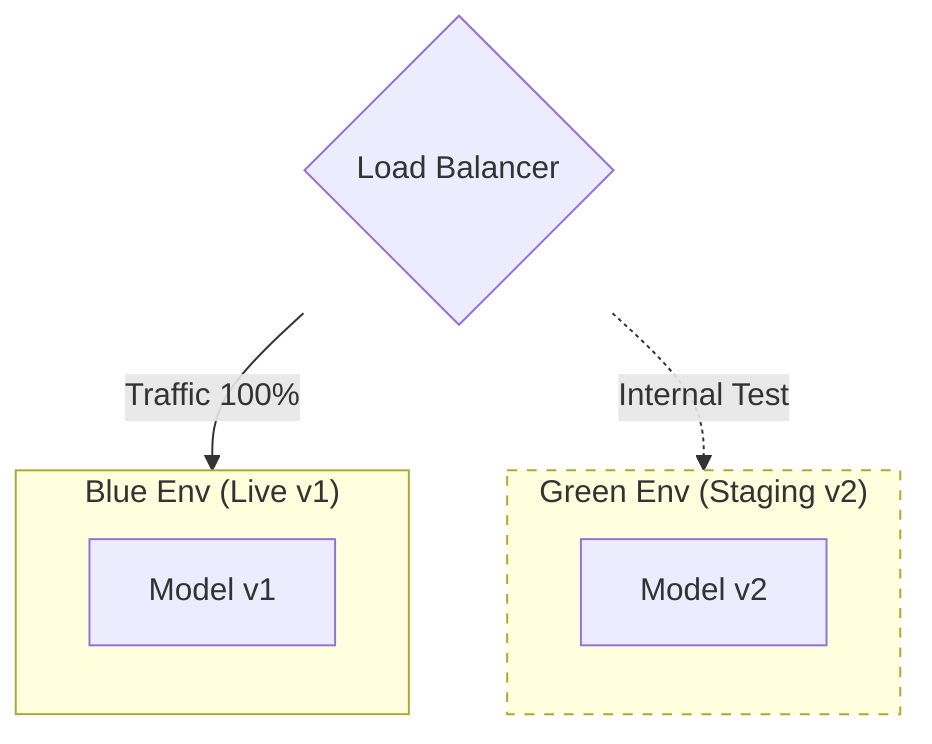

# ML Deployment Patterns

## Overview
**ML Deployment** is not just about "putting code on a server"; it is the transition of a model from a research artifact to a production software component. It encompasses **Serving** (how the model processes data) and **Release Strategies** (how the model is rolled out to users).

This note covers industry-standard patterns, heavily influenced by Google's *Machine Learning Design Patterns* and infrastructure best practices (Kubernetes/Istio).

## Key Ideas / Intuition
- **Decoupling Prediction from Release**: You can "deploy" a model (have it running) without "releasing" it (sending it user traffic).
- **Latency vs. Throughput**: Real-time systems optimize for latency (single request time); Batch systems optimize for throughput (total volume processed).
- **The "Model" is a Function**: Mathematically, deployment is just exposing $f(x) \rightarrow \hat{y}$ to the world, subject to constraints $C$ (latency, cost, privacy).

## Serving Patterns (How do we compute predictions?)

### 1. Static Reference (Batch / Offline Serving)
Pre-compute predictions for all possible users/items and store them in a database (e.g., BigTable, Redis) for fast lookup.
- **Mechanism**: A batch job runs everyday/hour, infers on the dataset, writes $key \rightarrow value$ to a DB.
- **Use Case**: Recommendations (Netflix "Top Picks"), Lead Scoring, Churn Prediction.
- **Pros**: Zero inference latency at request time, high throughput, simple infrastructure.
- **Cons**: "Staleness" (predictions are only as new as the last batch job), "Cold Start" (cannot handle new users not in the batch).

### 2. Dynamic Reference (Online / Real-time Serving)
Compute predictions on-demand when a request arrives.
- **Mechanism**: Model is wrapped in a container (REST/gRPC endpoint).
- **Use Case**: Fraud Detection (transaction happens NOW), Chatbots, Search Ranking.
- **Pros**: Handles dynamic content/new users, always fresh.
- **Cons**: Strict latency constraints, complex scaling (Auto-scaling groups, K8s).

### 3. Streaming (Asynchronous Serving)
A hybrid approach where events enter a queue (e.g., Kafka/PubSub), and a model processor consumes them.
- **Mechanism**: User $\rightarrow$ Event Bus $\rightarrow$ Model Worker $\rightarrow$ Result Store $\rightarrow$ Notification.
- **Use Case**: Uber ETA calculation (needs to be fast but decoupled), Content Moderation.
- **Pros**: Decouples producer from consumer, handles traffic spikes (backpressure).

### 4. Edge Deployment
Model runs on the client device (Phone, IoT, Browser).
- **Mechanism**: TFLite, ONNX, CoreML.
- **Use Case**: Face ID, Real-time translation, Privacy-preserving apps.
- **Pros**: Zero network latency, Privacy (data leaves device), Runs offline.
- **Cons**: Resource constraints (Battery/CPU), Difficult to update model version.

---

## Release Strategies (How do we roll out safely?)
*Standard patterns advocated by Google Cloud Architecture Center & SRE.*

### 1. Shadow Deployment (The "Dark" Launch)
The new model (Model B) receives real traffic in parallel with the current model (Model A), but **only Model A's predictions are returned to the user**. Model B's predictions are logged for analysis.
- **Goal**: Sanity check. Does Model B crash? Is the distribution of $\hat{y}$ wildly different?
- **Risk**: Zero user impact.
- **Cost**: Double the compute cost (running two models).

### 2. Canary Deployment
Roll out the new model to a small subset of users (e.g., 1% $\rightarrow$ 10% $\rightarrow$ 100%) before full replacement.
- **Goal**: Detect issues on a small scale.
- **Logic**: If `error_rate(v2) > threshold`, roll back immediately.
- **Traffic Split**:
  $$
  P(model = v2) = 
  \begin{cases} 
  0.01 & \text{Phase 1} \\
  0.10 & \text{Phase 2} \\
  1.00 & \text{Phase 3}
  \end{cases}
  $$

### 3. Blue/Green Deployment
Two identical environments (Blue = Live, Green = Idle Staging). Deploy v2 to Green. Test Green. Switch Router to point to Green.
- **Goal**: Atomic switchover with instant rollback capability.
- **Pros**: Zero downtime during deployment.
- **Cons**: Expensive (needs 2x infrastructure temporarily).
- **Critical Considerations**:
    - **Database Migrations**: Both Blue and Green often share the *same* database. Schema changes must be **backward compatible** (e.g., add a column, never rename/delete one) until both versions are fully switched.
    - **Gradual Switch**: While the switch *can* be instant, often it's done gradually (Load Balancer weights) to warm up caches.

### 4. A/B Testing (Online Experimentation)
Unlike Canary (which checks for *crashes*), A/B Testing checks for *business value*.
- **Mechanism**: Users are deterministically bucketed (e.g., `hash(user_id) % 100`) into Control (A) or Treatment (B).
- **Duration**: Weeks (to capture seasonality), not minutes.
- **Deep Dive**: See [[A B Testing]] for details on Hypothesis Testing ($H_0$), Sample Ratio Mismatch (SRM), and Power Analysis.

---

## LLM Deployment Patterns (Generative AI)
*Specialized patterns for Large Language Models due to their size (GBs/TBs) and autoregressive nature.*

### 1. Serving Engines
Standard web servers (Flask/FastAPI) are too slow for LLMs. Use specialized engines:
- **vLLM / TGI (Text Generation Inference)**: Optimizes memory management (PageAttention) to increase batch size.
- **TensorRT-LLM**: NVIDIA's optimized runtime for maximum throughput on GPUs.

### 2. The Adapter Pattern (LoRA Serving)
Instead of serving 10 fine-tuned 70B models (cost prohibits this), serve **one base model** and dynamically load small "Adapters" (Low-Rank Adapters) per request.
- **Mechanism**: Request contains `adapter_id`. Server loads the 100MB LoRA weights on top of the frozen 140GB base model.
- **Pros**: Multi-tenancy, massive cost reduction.

### 3. RAG (Retrieval-Augmented Generation)
Deploys a retrieval system alongside the model to inject fresh knowledge.
- **Flow**: User Query $\rightarrow$ Vector DB (Retrieve Context) $\rightarrow$ LLM (Generate Answer).
- **Pros**: Solves hallucinations, access to private data without fine-tuning.

---

## Technical Considerations & Math

### Latency Budget
For Online Serving, the Total Latency $L_{total}$ is the sum of network, queuing, and inference times.
$$L_{total} = L_{network} + L_{queue} + L_{inference} + L_{processing}$$
- **$L_{inference}$**: The time for `model.predict()`. Optimized via Quantization, Compilation (XLA/TensorRT).
- **$L_{network}$**: Minimize by putting endpoints close to users (Regional deployments).
- **Payload Size**: Large vectors/images increase $L_{network}$.

### LLM Latency Metrics
- **TTFT (Time To First Token)**: Latency until the user sees the first character. Crucial for "perceived" speed.
- **TPOT (Time Per Output Token)**: Speed of generation after the first token. (e.g., human reading speed is ~3-5 tokens/sec).
- **Total Latency**: $L = \text{TTFT} + (N_{tokens} \times \text{TPOT})$.

### Throughput vs. Latency
- **Batch Size ($B$)**: Increasing $B$ typically improves Throughput (predictions/second) but increases Latency per request (waiting to fill the batch).
- **Little's Law**: $L = \lambda W$ (Avg items in system = arrival rate $\times$ avg wait time).

---

## Comparisons: Release Strategies

| Strategy | Risk | Cost | Speed | Primary Use Case |
| :--- | :--- | :--- | :--- | :--- |
| **Recreate** (Downtime) | High | Low | Fast | Dev/Staging environments |
| **Shadow** | Lowest | High (2x) | Slow (Logging) | Validating new architecture/library |
| **Canary** | Low | Medium | Medium | Standard production rollout |
| **Blue/Green** | Low | High (2x) | Fast (Switch) | Critical systems needing instant rollback |
| **A/B Test** | User Experience Risk | Medium | Slow (Weeks) | Optimizing Model Performance (accuracy/revenue) |

---

## Practical Application
### Google/Industry Standards
- **TensorFlow Serving / TorchServe / Triton**: The standard containerized servers.
- **Vertex AI / SageMaker**: Managed services that abstract the Blue/Green or Canary logic.
- **Istio / KNative**: Kubernetes tools used to manage traffic splitting (e.g., "send 5% to v2").

### Common Pitfalls
1.  **Training-Serving Skew**: Features computed differently in Batch training (Spark) vs. Online serving (Go/Java). **Solution**: Feature Store.
2.  **Feedback Loops**: A model that biases future data (e.g., recommender only showing what it likes, creating a self-fulfilling prophecy).
3.  **Ignoring Tail Latency**: Optimizing for P50 latency but ignoring P99 latency (the 1% of users who have a terrible experience).

## Resources
- **Book**: "Machine Learning Design Patterns" (Lakshmanan, Robinson, Munn).
- **Docs**: [Google Cloud Architecture: MLOps: Continuous delivery and automation pipelines in machine learning](https://cloud.google.com/architecture/mlops-continuous-delivery-and-automation-pipelines-in-machine-learning)
- **Article**: [Martin Fowler: Continuous Delivery for Machine Learning](https://martinfowler.com/articles/cd4ml.html)

## Personal Notes
- *Shadow deployment is underrated for major model architecture changes (e.g., XGBoost -> Deep Learning).*
- *Always prefer Batch serving if the delay is acceptable. Online serving accounts for 90% of on-call incidents.*

## Progress Checklist
- [ ] Read overview
- [ ] Understand key concepts
- [ ] Review math (Latency/Traffic)
- [ ] Hands-on practice (Deploy a dummy model)
- [ ] Can explain to others

**Back to**: [[MLOps & Infrastructure Index]]
