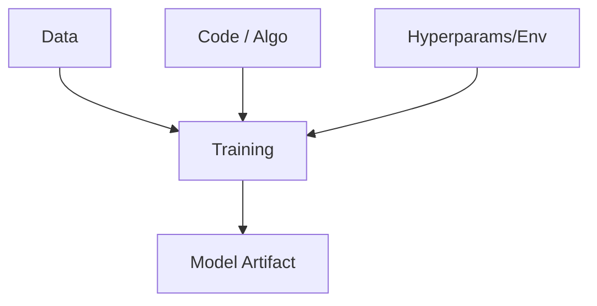

# ML Version Control Fundamentals

## Overview
**ML Version Control** is the practice of managing changes to the three pillars of Machine Learning: **Code**, **Data**, and **Models** (Environment/Config). Unlike traditional software engineering where versioning code is sufficient, ML sets a stricter requirement for reproducibility: you must be able to restore the exact state of the data and the training environment to reproduce a specific model version.

## Key Ideas / Intuition
### The Trinity of Artifacts
To reproduce a bug or a model in ML, you need a snapshot of three things simultaneously. If any one of these changes, the output (Model) changes.

### The "Time Machine" Problem
Imagine you trained a model 3 months ago that had 90% accuracy. Today's model has 85%. You checkout the old **code** (git commit), run it, and get... 82%. Why?
- The **Data** in the database changed.
- The **Dependencies** (library versions) updated.
- You didn't version the **Data** snapshot that was used 3 months ago.

### Data vs. Code (The Storage Problem)
*   **Git** is designed for text (line-by-line diffs). It chokes on large binary files (datasets, model weights).
*   **Solution**: Store Data in object storage (S3, GCS) and store a **pointer** (small text file with hash) in Git.

## Mathematical Foundation
Conceptually, a trained model $\mathcal{M}$ is a function of the training dataset $\mathcal{D}$, the algorithm code $\mathcal{A}$, and hyperparameters $\mathcal{H}$:
$$ \mathcal{M}_v = \text{Train}(\mathcal{D}_v, \mathcal{A}_v, \mathcal{H}_v) $$

For strict reproducibility:
$$ \mathcal{M}_{t1} \equiv \mathcal{M}_{t2} \iff (\mathcal{D}_{t1} = \mathcal{D}_{t2}) \land (\mathcal{A}_{t1} = \mathcal{A}_{t2}) \land (\mathcal{H}_{t1} = \mathcal{H}_{t2}) $$
Where $v$ denotes the version snapshot.

## Practical Application
### The Tool Stack
*   **Git**: Handles Code ($\mathcal{A}$) and Config ($\mathcal{H}$).
*   **DVC (Data Version Control)**: Handles Data ($\mathcal{D}$) and Model Artifacts ($\mathcal{M}$). It acts as a layer on top of Git.
*   **MLflow / Weights & Biases**: Logs metrics and hyperparameters (The "Captain's Log" of experiments).

### Typical Workflow (DVC + Git)
1.  **Change Data**: You add new images to `data/raw/`.
2.  **Version Data**: Run `dvc add data/raw`.
    *   This creates `data/raw.dvc` (the pointer).
    *   It moves actual data to `.dvc/cache` (and later pushes to S3).
3.  **Version Pointer**: Run `git add data/raw.dvc`.
4.  **Commit**: `git commit -m "Updated dataset with Q4 images"`.
    *   Now, that Git commit is mathematically linked to that specific version of the dataset.

### When to Use
*   **ALWAYS** for production ML pipelines.
*   **ALWAYS** when dataset size > 100MB (Git limit).
*   **ALWAYS** when collaboration requires sharing datasets.

## Comparisons

| Feature | Git | Git LFS (Large File Storage) | DVC |
| :--- | :--- | :--- | :--- |
| **Primary Target** | Text / Code | Large Binaries | Data & Models |
| **Storage Backend** | Internal / Git Host | Git Host Server | Agnostic (S3, GCS, Azure, SSH, Local) |
| **Deduplication** | Line-based | File-based | File-based (Content Addressable) |
| **ML Awareness** | None | None | High (Pipelines, Metrics) |
| **coupling** | Tightly coupled | Bound to Git Repo | Loosely coupled metadata |

> [!NOTE]
> **Why not just Git LFS?** LFS stores files on the Git server (e.g., GitHub). Storage there is expensive, and you often want your training data in the same cloud bucket as your compute (e.g., S3 + EC2) for speed. DVC allows using your own bucket.

## Resources
*   **Docs**: [DVC Documentation](https://dvc.org/doc)
*   **Article**: [Versioning Data and Models explained](https://martinfowler.com/articles/cd4ml.html)
*   **Video**: [DVC in 5 Minutes](https://www.youtube.com/watch?v=kGLh1erjn1Y)
*   **Concept**: [[MLOps Level 0 to Level 2]] (Google Cloud Maturity Model)

--- 
**Back to**: [[03 - MLOps & Infrastructure Index]]
