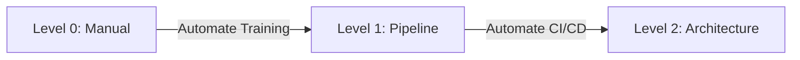

# MLOps Level 0 to Level 2 (Google Cloud Maturity Model)

## Overview
The **MLOps Maturity Model** describes the evolution of a Machine Learning system from a manual, experimental process to a fully automated, reliable software engineering discipline. It defines three distinct levels of maturity, focusing on the automation of Data extraction, Model training, and Deployment.

## Key Ideas / Intuition
*   **The "Chasm"**: The jump from Level 0 to Level 1 is the hardest. It requires treating ML code not as a script to *run*, but as a pipeline to *orchestrate*.
*   **CI/CD/CT**: Traditional software needs CI (Integration) and CD (Deployment). MLOps adds **CT (Continuous Training)** because models decay over time even if the code doesn't change.

## Deep Dive: The Three Levels

### Level 0: Manual Process
**"The Notebook Data Scientist"**

This is where most projects start. The focus is on *State-of-the-Art* (SOTA) model quality, not infrastructure.
*   **Workflow**:
    1.  DS extracts data manually (SQL queries to CSVs).
    2.  DS cleans and trains in a Jupyter Notebook.
    3.  DS hands off a model artifact (file) to the Engineering team.
*   **Characteristics**:
    *   **Manual**: Every step (preparing data, tuning params) is manual.
    *   **Script-driven**: Code is often in notebooks or monolithic scripts.
    *   **Disconnect**: The person training (DS) is different from the person deploying (Eng).
*   **Pain Points**:
    *   **"Works on my machine"**: The engineering team can't replicate the DS's environment.
    *   **Staleness**: Models are rarely retrained because it's a pain to do so.

### Level 1: ML Pipeline Automation
**"Automated Training"**

The goal here is **Continuous Training (CT)**. We automate the training process so we can retrain frequently on fresh data.
*   **Workflow**:
    1.  DS writes modular code (preprocessing.py, train.py).
    2.  An orchestration tool (Airflow, Prefect, Kubeflow) runs the DAG.
    3.  The pipeline pushes the trained model to a Model Registry.
*   **Key Requirements**:
    *   **[[ML Version Control Fundamentals]]**: You MUST version data and code to make the pipeline reproducible.
    *   **Metadata Store**: Tracking which run produced which model.
*   **The Shift**: We deploy the *pipeline* to production, not just the *model*.

### Level 2: CI/CD Pipeline Automation
**"Automated Deployment"**

The goal here is rapid experimentation. We want to update the *pipeline structure* itself safely.
*   **Workflow**:
    1.  DS opens a Pull Request modifying `train.py`.
    2.  **CI (Continuous Integration)** runs unit tests and building the pipeline components.
    3.  **CD (Continuous Deployment)** deploys the new pipeline to a staging environment.
    4.  The pipeline runs (CT) and produces a candidate model.
    5.  **Automated Evaluation**: The candidate model is tested against the current Production model (A/B test or offline metrics).
    6.  If better, it is promoted to Production.
*   **Characteristics**:
    *   **Feature Store**: Consistent features for training and serving.
    *   **Automated Testing**: both Code tests (unit tests) and Data tests (schema validation).

## Comparisons

| Feature | Level 0 (Manual) | Level 1 (Pipeline) | Level 2 (CI/CD) |
| :--- | :--- | :--- | :--- |
| **Script Format** | Notebooks | Modular Scripts (Containerized) | Modular Packages |
| **Training** | Manual | Automated (Scheduled/Triggered) | Automated + Tested |
| **Deployment** | "Here is the .pkl file" | Deploy the Model from Registry | Deploy the Pipeline code |
| **Release Cycle** | Weeks/Months | Daily/Weekly (Data refresh) | Hourly (Code changes) |
| **Testing** | None (Visual check) | Model Validation | CI (Unit) + CD (Integration) |

## Resources
*   **Paper**: [Hidden Technical Debt in Machine Learning Systems](https://papers.nips.cc/paper/2015/file/86df7dcfd896fcaf2674f757a2463eba-Paper.pdf) (Google)
*   **Guide**: [Google Cloud: MLOps Continuous Delivery and Automation Pipelines](https://cloud.google.com/architecture/mlops-continuous-delivery-and-automation-pipelines-in-machine-learning)
*   **Related Note**: [[ML Version Control Fundamentals]]

## Personal Notes
*   

## Progress Checklist
- [ ] Read overview
- [ ] Understand the "Chasm" between Level 0 and 1
- [ ] Visualise the added complexity of CT and CI/CD
- [ ] Hands-on practice (Build a simple Level 1 pipeline with Prefect/Airflow)
- [ ] Can explain to others

**Back to**: [[03 - MLOps & Infrastructure Index]]
