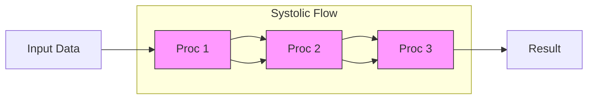

# TPU (Tensor Processing Unit) Overview

## Overview
A **Tensor Processing Unit (TPU)** is a Domain-Specific Architecture (DSA) developed by Google, custom-designed from the ground up to accelerate Machine Learning burdens. While CPUs are general-purpose and GPUs are parallel-processors originally for graphics, TPUs are **Matrix Multiplication Engines** built specifically for the heavy linear algebra found in Neural Networks.

They are the hardware backbone of Google's AI infrastructure, powering everything from Search and Translate to massive LLMs like Gemini.

## Key Ideas / Intuition

### 1. The Heartbeat: Systolic Arrays
The defining feature of a TPU is the **Systolic Array**.
*   **Analogy**: Imagine a bucket brigade or a human heart (systolic).
*   **Traditional (CPU/GPU)**: Drivers (registers) fetch data, do an operation, and write it back. This is "register-heavy" and requires constant memory access.
*   **Systolic**: Data flows *through* the array of processors like blood. Processor A hands its result directly to Processor B, which hands it to C, and so on.
*   **Benefit**: This drastically reduces memory access (the most expensive operation). Data is read once and reused across thousands of operations.

### 2. Matrix-First Design
*   **CPU**: Scalar (1x1). Good for logic.
*   **GPU**: Vector (1xN). Good for arrays.
*   **TPU**: Matrix (MxN). Good for tensors.
The TPU instruction set allows it to perform a full matrix multiplication in a single instruction cycle, rather than issuing thousands of vector instructions.

## Architecture Deep Dive

### MXU (Matrix Multiply Unit)
The engine block. A generic TPU core contains one or more MXUs.
*   An MXU is essentially a massive Systolic Array (e.g., 128x128).
*   It performs hundreds of thousands of Multiply-Accumulates (MACs) per cycle.

### HBM (High Bandwidth Memory)
TPUs use HBM (like modern GPUs) instead of standard RAM.
*   **Why**: The Systolic Array is so fast it would starve without massive bandwidth feeding it data.
*   **Location**: Integrated directly onto the board next to the chip to minimize latency.

### ICI (Inter-Chip Interconnect)
TPUs are designed to function as a supercomputer (a **Pod**).
*   **Interconnect**: Chips are connected directly to each other via high-speed links, forming a **Torus** topology (2D or 3D).
*   **Result**: No needing to go through the host CPU or standard networking to talk to neighbor TPUs. This allows for near-linear scaling during distributed training.

### Generations
| Gen | Focus | Architecture | Notable Feature |
| :--- | :--- | :--- | :--- |
| **v4** | Training | 3D Torus | Unified HBM, Optical Circuit Switches |
| **v5e** | Efficiency | 2D Torus | Cost-optimized for inference/medium training |
| **v5p** | Performance | 3D Torus | Massive scale (8960 chips/pod) for LLMs |

## Mathematical Foundation

### bfloat16 (Brain Floating Point)
Google introduced `bfloat16` to solve a specific ML problem: FP16 is fast but has a tiny dynamic range (prone to underflow/overflow), while FP32 is precise but slow and memory-heavy.

**The Format**:
*   **Sign**: 1 bit
*   **Exponent**: 8 bits (Same as FP32!)
*   **Mantissa**: 7 bits (Truncated from FP32)

$$ \text{Value} = (-1)^S \times 2^{E-127} \times (1.M) $$

*   **Why it wins**:
    1.  **Dynamic Range**: Since the exponent is the same as FP32, you rarely need to do "Loss Scaling" (a headache in FP16 training).
    2.  **Hardware**: Multipliers are cheaper to build (smaller mantissa).
    3.  **Speed**: Effective double throughput compared to FP32.

### Mixed Precision
TPUs typically operate in **Mixed Precision**:
1.  **Inputs**: Read in `bfloat16`.
2.  **Compute**: Matrix multiplication happens.
3.  **Accumulation**: The result is accumulated in `FP32` to preserve precision during the summation.
4.  **Output**: Converted back to `bfloat16` or `FP32` as needed.

## Comparison: TPU vs. GPU

| Feature | GPU (NVIDIA) | TPU (Google) |
| :--- | :--- | :--- |
| **Philosophy** | "Swiss Army Knife" (Graphics, HPC, AI) | "Scalpel" (AI Only) |
| **Core Ops** | Threads, Warps, CUDA Cores | Systolic Arrays, Matrix Ops |
| **Memory** | HBM (VRAM) managed explicitly | HBM / Software-Managed Scratchpad |
| **Ecosystem** | CUDA (Flexible, mature, broad) | XLA (Graph-based, rigid, fast) |
| **Best For** | Research, weird custom ops, small batches | Massive static graphs, huge batch sizes |
| **Floating Point** | FP16 / TF32 / FP32 | bfloat16 (Native) |
| **Availability** | Everywhere (Cloud + Consumer) | Google Cloud Only (mostly) |

## Practical Application (MLOps)

### When to Use a TPU
*   **Massive Scale**: You are training a Foundation Model (LLM) across hundreds/thousands of chips. The ICI topology shines here.
*   **Standard Architectures**: Transformers, CNNs, ResNets. The XLA compiler has highly optimized kernels for these.
*   **JAX / TensorFlow**: These frameworks are native to TPU. PyTorch/XLA works but adds a compilation overhead layer.

### When NOT to Use a TPU
*   **Small Batches**: Systolic arrays take time to "fill up". If the batch is small, the pipeline bubbles (empty slots) kill performance.
*   **Custom Ops**: If you have a weird, non-standard layer (e.g., custom varying loop logic) that XLA can't fuse, it falls back to the CPU, destroying performance.
*   **Sparse Data**: Historically, TPUs hated sparsity, though v4/v5 sparse-cores are improving this.

### Common Pitfall: recompilation
TPUs compile the compute graph (XLA) before running.
*   **The Trap**: If your input shapes change (dynamic shapes), the TPU must **recompile** the entire graph. This can take minutes.
*   **Fix**: Always use **Padding** to ensure fixed input shapes (e.g., pad all sentences to length 128).

## Resources
*   **Paper**: [In-Datacenter Performance Analysis of a Tensor Processing Unit](https://arxiv.org/abs/1704.04760) (The original paper, highly readable).
*   **Google Cloud**: [TPU Architecture documentation](https://cloud.google.com/tpu/docs/system-architecture-tpu-vm).
*   **Video**: [Google I/O: Cloud TPU Pods](https://www.youtube.com/watch?v=MXxN4fv01c8) - great visuals of the layout.

---
**Back to**: [[03 - MLOps & Infrastructure Index]]
